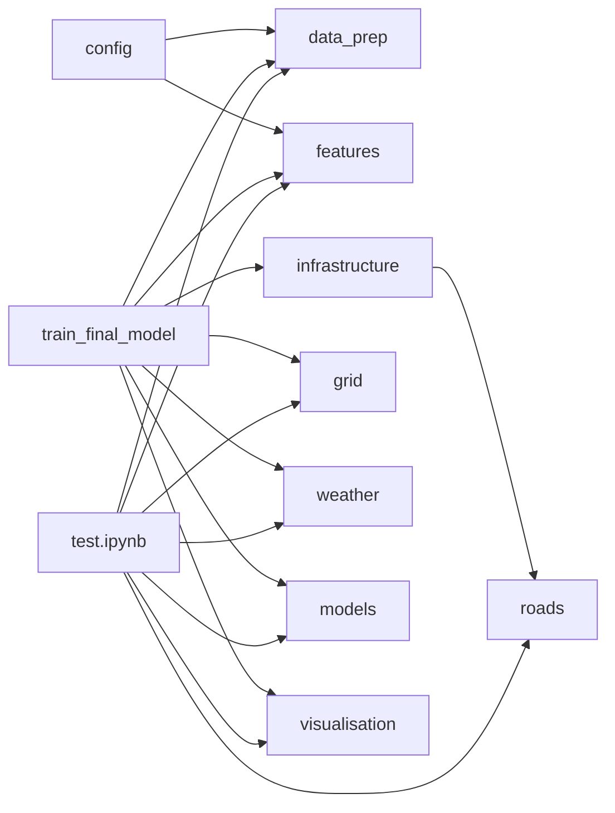

> A bachelor's thesis codebase that predicts wildlife-vehicle collision risk in Sweden. It reads twelve years of Swedish collision records (NVR), builds a 10×10 km grid over the country, joins each grid cell to roads, railways, fences and speed-limit segments, fetches matching SMHI weather (temperature + precipitation), engineers seasonal/hunting/rutting/light-condition features, and trains a Random Forest + Logistic Regression on the resulting cell-month panel to predict whether each cell is "high-risk" in a given month. The pipeline is fully modular: the canonical entry point is `scripts/train_final_model.py` (run via `.venv/bin/python scripts/train_final_model.py`). The notebook `notebooks/test.ipynb` is retained as a scratchpad but is no longer the orchestrator. The README at root predates the migration and is partially stale — trust this document and `notes/PROJECT_BIBLE.md` (workspace-level) over the README.

# Quick reference

| Path | What it is | Who creates it | Safe to delete? |
|------|------------|----------------|-----------------|
| `.claude/` | Claude Code project settings (permissions allowlist) | You / Claude Code | Yes — only loses Claude permissions |
| `.DS_Store` (multiple) | macOS Finder metadata | macOS Finder | Yes — Finder rewrites it |
| `.git/` | Git repository internals | `git init` | No — loses all history |
| `.gitignore` | Git ignore rules | You | No — accidental commits would follow |
| `.idea/` | PyCharm project state | PyCharm | Yes — IDE rebuilds, you re-pick interpreter |
| `.pytest_cache/` | pytest's last-run cache | pytest | Yes — pytest rebuilds |
| `.venv/` | Python virtual environment, 708 MB | `python -m venv .venv` | Yes — rebuilds from `pyproject.toml` |
| `CLAUDE_versions/` | Backup copies of `CLAUDE.md` | You | Yes — historical reference only |
| `CLAUDE.md` | Repo-scoped instructions for Claude Code | You | Yes — Claude loses repo context |
| `config/` | YAML hyperparameters | You | No — pipeline reads it |
| `data/` | Raw NVR/Trafikverket/SMHI inputs + processed outputs (~3.4 GB) | You / pipeline | Some yes, some no — see [[data]] |
| `diagrams/` | Static call-graph + tree dumps | You (one-off) | Yes — regeneratable, but stale |
| `notebooks/` | Jupyter notebooks — `test.ipynb` scratchpad + `sample.ipynb` (held for Amanda) | You | `test.ipynb` keep; `sample.ipynb` pending Amanda check |
| `REPO_EXPLAINED.md` | This document — beginner-friendly walkthrough of every file and function | Claude Code | Yes — regeneratable |
| `outputs/` | Trained models (.joblib, ~617 MB) + figure PNGs | The pipeline | Yes — pipeline regenerates |
| `pyproject.toml` | Package metadata + dependencies | You | No — defines the project |
| `README.md` | Front-page docs (partially stale) | You | No — but rewrite recommended |
| `scripts/` | Entry-point scripts (`train_final_model.py`) | You | No — main entry |
| `src/` | The Python package: 9 modules | You | No — the actual code |
| `tests/` | pytest smoke tests (6 files) | You | No — guards regressions |
| `thesis_boogaloo.egg-info/` | Setuptools editable-install metadata | `pip install -e .` | Yes — pip rebuilds |

# How to read this document

Each top-level folder gets its own section, each file inside gets its own subsection, and every function in `src/` gets a function-level entry with calls/called-by cross-links. In Obsidian, click any `[[wikilink]]` to jump to the linked entry. Use the tags in the YAML frontmatter to filter the graph view. Acronyms are unpacked at first mention; later mentions stay short. The "What if I deleted it" judgement is given for every file or folder.

# Project root

```
code/
├── .claude/              ← Claude Code project settings
├── .git/                 ← Git internals (collapsed)
├── .gitignore            ← Git's ignore rules
├── .idea/                ← PyCharm project state (collapsed)
├── .pytest_cache/        ← pytest's last-run cache (collapsed)
├── .venv/                ← Python virtual environment, 708 MB (collapsed)
├── .DS_Store             ← macOS Finder metadata
├── CLAUDE.md             ← Claude Code repo-scoped instructions
├── CLAUDE_versions/      ← Backup copies of CLAUDE.md
├── README.md             ← Front-page docs (partially stale)
├── config/               ← hyperparameters.yaml
├── data/                 ← All input + intermediate data, ~3.4 GB
├── diagrams/             ← Static call-graph + tree dumps
├── notebooks/            ← Jupyter notebooks (test.ipynb scratchpad — calls src/ modules)
├── outputs/              ← Pipeline's models/ and figures/
├── pyproject.toml        ← Package metadata + dependencies
├── scripts/              ← Entry-point scripts (train_final_model.py)
├── src/                  ← The thesis_boogaloo Python package
├── tests/                ← pytest smoke tests
└── thesis_boogaloo.egg-info/  ← Setuptools editable-install metadata
```

The pipeline has one canonical entry point: `scripts/train_final_model.py`. The notebook (`notebooks/test.ipynb`) is retained as a scratchpad for ad-hoc exploration but is no longer the orchestrator — both import the same modules from `src/`, but the script is what you run to produce results. The migration from notebook to modular script completed 2026-04-30 (Phases 0–9).

# Top-level folders

## `.claude/`

Claude Code's project-level settings folder. Created automatically the first time Claude Code touches the repo. Holds per-project preferences such as which tools Claude is allowed to use without asking.

**What if I deleted it:** Claude Code re-creates it next session and re-asks for any permissions you previously granted.

**Tag:** `#folder/ide-artefact` `#file/config`

### `.claude/settings.local.json`

92-byte JSON file. Contents:

```json
{
  "permissions": {
    "allow": [
      "WebFetch(domain:docs.anthropic.com)"
    ]
  }
}
```

Tells Claude Code that it doesn't need to ask before fetching pages from `docs.anthropic.com`. The `local` in the filename is the convention — `settings.local.json` is per-machine and gitignored, while `settings.json` (not present here) would be shared across collaborators.

**What if I deleted it:** Next time Claude tries to fetch from `docs.anthropic.com`, it asks once. Approve, and the file comes back.

**Tag:** `#file/config`

---

## `.git/`

Git's internal repository. Stores every commit, branch, and change ever made to the codebase. The visible files in the rest of the project folder are the *current snapshot*; `.git/` is the record of everything that ever was. See "Standard project artefacts" below for the generic explanation.

**What if I deleted it:** Project loses all history. Recoverable only by re-cloning from `https://github.com/aw950309/thesis_boogaloo.git`.

**Tag:** `#folder/version-control`

---

## `.idea/`

PyCharm's project configuration folder. JetBrains products write here to remember which Python interpreter is selected, which files were open last session, project-level inspections, run configurations, and a long history of work-time tracking. PyCharm-Professional features (database explorer, run-configuration sharing) also persist state in here.

**What if I deleted it:** PyCharm forgets which Python interpreter to use, asks you to re-pick it, and forgets your open files. Source code is unaffected. Most teams gitignore `.idea/`. This repo's `.gitignore` line 25 already does so.

**Tag:** `#folder/ide-artefact`

### `.idea/.name`

12 bytes. Just contains the literal string `sample.ipynb`. PyCharm uses this as the display name in the title bar. It picked the name from a notebook that was once primary but has since been demoted (the live notebook is now `test.ipynb`). Cosmetic only.

### `.idea/copilot.data.migration.ask2agent.xml`

194 bytes. A marker file written by the GitHub Copilot plugin recording that it has migrated its data from the old "Ask" UI to the new "Agent" UI. Useless after migration; cannot be deleted without Copilot wanting to migrate again.

### `.idea/inspectionProfiles/profiles_settings.xml`

174 bytes. Tells PyCharm which static-analysis profile to use for this project. Currently set to "use the IDE-level profile, not a project-specific one."

### `.idea/misc.xml`

303 bytes. Miscellaneous PyCharm state. The interesting field here is the project's selected Python SDK: `Python 3.14 (code)`. Confirms this project runs on Python 3.14, which is unusually new (3.14 entered general availability in late 2025).

### `.idea/modules.xml`

282 bytes. PyCharm's list of "modules" in the project. Just one — `thesis_boogaloo.iml`.

### `.idea/thesis_boogaloo.iml`

525 bytes. The actual module descriptor. Marks `src/` as a source folder (so PyCharm treats it as importable Python), excludes `.venv/` and `models/` from indexing.

### `.idea/vcs.xml`

180 bytes. Tells PyCharm "this directory is a Git repository." Without it, PyCharm wouldn't show Git status in the gutter.

### `.idea/workspace.xml`

11 KB. The big PyCharm state file. Touched every session. Contains:

- The list of past commit messages (which is how the file accumulated Swedish messages like "Cleanat upp sample" and the project's first commits)
- A reference to two Windows paths Amanda's machine used: `C:\Users\Amanda\PycharmProjects\thesis_boogaloo\data\Speedlimit` and `C:\Users\amand\PycharmProjects\thesis_boogaloo` (cosmetic; just PyCharm's "recent" list)
- A breakpoint set on `src/features.py` line 13 and one on `notebooks/test2.ipynb` line 1 (artefacts of past debugging)
- The currently selected GitHub PR filter (`assignee=Stephanosons`, `state=OPEN`)
- Old coverage suite references (`coverage/thesis_boogaloo$get_temperatures.coverage` etc.) that point at deleted files

PyCharm rewrites this file constantly. Do not edit by hand.

**Tag:** `#file/ide-artefact`

---

## `.pytest_cache/`

pytest's per-project cache directory. Created the first time you ran `pytest` in this folder. Pytest uses it for:

- `--lf` (last failed): re-run only tests that failed last time
- `--ff` (failed first): run failed tests first, then everything else

**What if I deleted it:** pytest re-creates it the next run. The next `--lf` would find no record of last failures, so it would run everything. Functionally inert.

**Tag:** `#folder/cache`

### `.pytest_cache/CACHEDIR.TAG`

A small file following the [Cache Directory Tagging](https://bford.info/cachedir/) convention from 2002. Backup tools that respect the spec (some, not all) read this and skip the directory. Saves backup space.

### `.pytest_cache/.gitignore`

Two lines: `# Created by pytest automatically.` and `*`. Tells Git to ignore everything in this folder.

### `.pytest_cache/README.md`

A short README pytest auto-writes explaining what the folder is and that you should not commit it.

### `.pytest_cache/v/cache/nodeids`

JSON array of every test node pytest has seen, e.g. `tests/test_data_prep.py::test_load_collision_data_round_trip`. Right now lists 24 tests across the six test files.

---

## `.venv/`

The Python virtual environment. 708 MB on disk, contains an isolated Python 3.14 installation plus 128 installed packages. Created with `python -m venv .venv` and populated by `pip install -e .` per the [[README]].

**Inside:**

- `bin/` — executables: `python`, `pip`, `jupyter`, `pytest`, etc., all bound to this environment
- `lib/python3.14/site-packages/` — the installed packages (NumPy, pandas, geopandas, etc.)
- `share/` — Jupyter kernel specs and other supporting files
- `etc/` — config files for some packages
- `pyvenv.cfg` (not visible at the root listing but present) — marks the folder as a venv

**Why so big:** geopandas, shapely, pyproj, fiona/pyogrio, scipy, scikit-learn, matplotlib, fastparquet — each is tens of megabytes of native code. Total ~700 MB is normal for a GIS+ML stack.

**Why it's gitignored:** Reconstructable from `pyproject.toml`. Different per-OS (macOS dylib vs Linux .so vs Windows .dll). No benefit to committing.

**What if I deleted it:** Run `python3.14 -m venv .venv && source .venv/bin/activate && pip install -e .` to rebuild. Slow but lossless.

**Tag:** `#folder/venv`

### Notable contents inside `.venv/lib/python3.14/site-packages/`

This is normally a folder of vendored library code that doesn't warrant per-file walks. The packages relevant to this project are catalogued in the "Dependencies" section below. A few files at the *root* of `site-packages/` are worth naming once:

- `__editable__.thesis_boogaloo-0.1.0.pth` and `__editable___thesis_boogaloo_0_1_0_finder.py` — the mechanism by which `pip install -e .` makes `from src.features import ...` work even though `src/` lives outside `site-packages/`. The `.pth` file points pip at the `src/` folder; the `_finder.py` is the import hook. Generated automatically.
- `__editable__.unknown-0.0.0.pth` (49 bytes) — a leftover from a previous, broken editable install when `pyproject.toml` didn't yet specify a project name. Harmless but stale.
- `_virtualenv.py` and `_virtualenv.pth` — virtualenv's bootstrap shim.

The full installed-package list is given under "Dependencies" below.

---

## `CLAUDE_versions/`

A folder you created to keep historical copies of `CLAUDE.md`. Currently contains one file. Not a Claude-Code convention; just a local backup habit.

### `CLAUDE_versions/CLAUDE_2026-04-pre-migration.md`

2 KB. The pre-migration version of `CLAUDE.md`, snapshotted before the notebook→script migration started rewriting it. Useful as a "what did Claude Code know before Phase 3" reference. Notable difference from the current [[CLAUDE]]: it claimed the orchestrator already lived in `scripts/train_final_model.py`, when in reality it was still a stub.

**What if I deleted it:** No operational impact. Historical reference only.

**Tag:** `#file/documentation`

---

## `config/`

Configuration files separate from code. Just one file inside.

### `config/hyperparameters.yaml`

811 bytes. The model hyperparameters. Loaded by `models.load_hyperparameters()` (see [[models]]) and passed into `evaluate_time_splits()` and `fit_final_model()`.

Contents (paraphrased):

```yaml
random_forest:
  n_estimators: 100
  class_weight: balanced
  random_state: 42
  n_jobs: -1     # use all CPU cores

logistic_regression:
  max_iter: 3000
  class_weight: balanced

calibration:
  method: isotonic
  cv: 3

species:
  - moose
  - roe_deer
  - wild_boar
  - fallow_deer
```

The `species` list is documentation only — no code path reads it.

**File format:** YAML — see Glossary.

**What if I deleted it:** The pipeline's `models.load_hyperparameters()` call in [[train_final_model]] would fail at runtime with `FileNotFoundError`.

**Tag:** `#file/config`

---

## `data/`

Where every input dataset lives. Total ~3.4 GB. Gitignored via `.gitignore` line 2 (`data/`), so the data is *never* committed — collaborators must obtain the files separately. See the [[README]] (paragraph "Data Sources") for provenance.

Subfolders, top-down:

- `Barrairanalys/` — Trafikverket fence/barrier geometries (typo for "Barriäranalys"; not worth fixing because the folder name is referenced in code via the path bundle in [[train_final_model]])
- `Collisions/` — twelve yearly NVR collision CSVs, one per year 2015–2026
- `Järnvägnät_grundegenskaper/` — Trafikverket railway network
- `Sverige_Vägtrafiknät_GeoPackage/` — Trafikverket road network (Sverige = "Sweden", Vägtrafiknät = "road traffic network")
- `Speedlimit/` — Trafikverket speed-limit segments (the ISA dataset)
- `processed/` — pipeline outputs and parquet caches
- `raw/` — small auxiliary CSVs (just `stations_fixad.csv` today)

**Tag:** `#folder/data`

### `data/Barrairanalys/Barriaranalys.gpkg`

110 MB. A GeoPackage (`.gpkg`) — see Glossary — containing fence and barrier line geometries from Trafikverket's "Barriäranalys" dataset. SQLite under the hood; opens with any GeoPackage reader (including geopandas). Used by `infrastructure.build_infrastructure_features` (see [[infrastructure]]) to compute per-cell fence length, density, and nearest-fence distance. Read with `layer="barriarer_kvarvarande_vag"` (the "remaining road barriers" layer; see [[infrastructure]] line 589).

**File format:** GeoPackage — see Glossary.

**What if I deleted it:** The pipeline's fence-features step crashes; the test suite still passes (it uses tiny in-memory fixtures). Re-download from Trafikverket Lastkajen.

### `data/Collisions/`

Twelve yearly NVR ("Nationella Viltolycksrådet" — National Wildlife Accident Council) collision CSVs. The mojibake-rendered filename `R†data 2015.csv` is `Råddata 2015.csv` in correct Swedish — the original byte sequence is valid Latin-1, just rendered weirdly in some shells.

Encoding inside the file is also Latin-1, semicolon-separated, with Swedish decimal commas. Header (translated):

```
DjurID;OlycksID;Typ av olycka;Datum;Län;Kommun;Viltslag;
Lat WGS84;Long WGS84;Lat RT90;Long RT90;Kön;Årsunge;Vad har skett med viltet
```

That is: `AnimalID;AccidentID;Type of accident;Date;County;Municipality;Species;Lat WGS84;Long WGS84;Lat RT90;Long RT90;Sex;YearOfBirthIsThisYear;WhatHappenedToTheAnimal`.

Total row counts (excluding header):

| Year | Rows |
|------|------|
| 2015 | 45,438 |
| 2016 | 56,600 |
| 2017 | 58,944 |
| 2018 | 63,689 |
| 2019 | 64,702 |
| 2020 | 62,244 |
| 2021 | 68,635 |
| 2022 | 67,920 |
| 2023 | 71,476 |
| 2024 | 77,733 |
| 2025 | 77,140 |
| 2026 | 19,968 (incomplete) |

The 2026 file is excluded by [[train_final_model]] via `year_range=(None, 2025)`.

**File format:** CSV — see Glossary.

**What if I deleted them:** The pipeline cannot run. Re-download from NVR (Nationella Viltolycksrådet).

### `data/Järnvägnät_grundegenskaper/Järnvägsnät_grundegenskaper3_0_GeoPackage.gpkg`

120 MB. Trafikverket's railway network ("Järnvägsnät grundegenskaper" = "railway network basic properties"). Read by [[infrastructure]] without specifying a layer — geopandas picks the default. Used to compute per-cell railway length, density, and nearest-rail distance.

**Format:** GeoPackage — see [[Barriaranalys]] above for format explanation.

### `data/Sverige_Vägtrafiknät_GeoPackage/Sverige_Vägtrafiknät_194602.gpkg`

1.4 GB. The big one. The Swedish national road network as line geometries. The `194602` is the order number from Trafikverket's Lastkajen delivery service. CRS is EPSG:3006 (SWEREF99 TM, Sweden's national projected coordinate system).

This is the dataset that all `road_*` features come from. The road class column is `Nattyp` (Swedish for "network type"); [[train_final_model]] keeps only `bilnät` ("car network") roads when computing road features.

### `data/Sverige_Vägtrafiknät_GeoPackage/Leveransinformation_194602.txt`

435 bytes. The Trafikverket Lastkajen delivery slip — order name, date (2026-04-08), format, CRS, scope ("Sverige" / Sweden). Documentary only.

### `data/Sverige_Vägtrafiknät_GeoPackage/Licensinformation.txt`

166 bytes. Says (Swedish, mojibake): by using the data you accept the agreement at `https://creativecommons.org/publicdomain/zero/1.0/deed.sv` — the data is CC0 (public domain).

### `data/Speedlimit/ISA.gpkg`

1.4 GB. Trafikverket's ISA dataset (Intelligent Speed Adaptation — the speed-limit segment file). The relevant column is `HTHAST` (Högsta tillåtna hastighet — "highest permitted speed"). [[infrastructure]] uses this to derive: weighted-mean speed-limit per cell, max, min, share of "≥90 km/h" length.

### `data/Speedlimit/Kolumnnamn.txt`

2.5 KB. Lookup table mapping cryptic column names like `HTHAST` to Swedish full names ("Högsta tillåtna hastighet"). 41 columns documented. Reference material; pipeline code only consumes `HTHAST`.

### `data/Speedlimit/Licensinformation.txt`

168 bytes. Same CC0 licence notice as the road network's `Licensinformation.txt`.

### `data/processed/`

Where the pipeline writes its output and caches intermediate parquet files.

**Tag:** `#folder/data` `#folder/cache`

#### `data/processed/cache/`

(Per the project bible's registry; expected to exist when the pipeline has run, may be empty otherwise.) Parquet caches for the four infrastructure feature dataframes — `road_features.parquet`, `rail_features.parquet`, `fence_features.parquet`, `speedlimit_features.parquet`. Written by `infrastructure.build_infrastructure_features` (see [[infrastructure]]). The cache lets you re-run the pipeline without re-doing the slow GeoPackage spatial joins.

**What if I deleted it:** First post-deletion run is slow (re-computes all four). Subsequent runs return to normal cached speed.

#### `data/processed/feature_importance.csv`

1.1 KB. Output of the model — a 31-row CSV mapping each feature to its mean Random Forest feature-importance across all expanding-window folds. Top of the current file:

```
,0
roe_deer_lag1,0.179
road_density,0.178
night_lag1,0.084
fence_density,0.071
fence_near_10km,0.056
day_lag1,0.049
speedlimit_mean_weighted,0.043
...
```

Written by `export_artefacts()` in [[train_final_model]] line 224.

#### `data/processed/model_df_clean.csv`

55 MB. The cleaned cell-month modelling dataframe — every grid cell × month with all 31 features merged in, plus the `risk` label and the `risk_prob` column (RF predicted probability). Written by [[train_final_model]] line 223. This is the single canonical model dataset the thesis figures and tables draw from.

Schema (head): `cell_id, period_start, collision_count, risk, road_length_m, cell_area_m2, road_density, nearest_road_distance_m, road_class_bilnät_length_m, rail_length_m, rail_density, nearest_rail_distance_m, rail_near_10km, fence_length_m, fence_density, nearest_fence_distance_m, fence_near_10km, speedlimit_mean_weighted, speedlimit_max, speedlimit_min, speedlimit_90plus_share, speedlimit_segment_length_m, temp_mean, temp_min, temp_max, precip_total, fallow_deer_lag1, moose_lag1, roe_deer_lag1, wild_boar_lag1, dawn_lag1, day_lag1, dusk_lag1, night_lag1, month, month_sin, month_cos, moose_hunting_frac, wild_boar_hunting_frac, roe_deer_hunting_frac, fallow_deer_hunting_frac, moose_rut_frac, roe_deer_rut_frac, wild_boar_rut_frac, fallow_deer_rut_frac, risk_prob`

#### `data/processed/model_summary.csv`

255 bytes. The model-evaluation summary table. Means and standard deviations of AUC, precision, recall, F1, accuracy across all expanding-window folds, broken down by model:

```
       auc          precision      recall        f1            accuracy
       mean   std   mean   std    mean   std    mean   std    mean   std
logreg 0.955 0.007  0.433 0.078   0.943 0.048   0.59  0.077   0.85  0.027
rf     0.957 0.01   0.78  0.075   0.453 0.137   0.561 0.123   0.923 0.016
```

Logistic Regression has high recall but low precision (catches almost all risk-positive cells but with many false alarms); Random Forest is the opposite (fewer false alarms but misses more positives). AUC ≈ identical at 0.96.

Written by [[train_final_model]] line 225.

### `data/raw/stations_fixad.csv`

107 KB. A list of SMHI weather stations. Header (Swedish): `Id;Namn;Ägare;Nät;Latitud;Longitud;Höjd (m);Från;Till;Aktiv;Mobil;Vattendrag;Vattendragsnr;Area (km²)`. The `fixad` ("fixed") in the filename suggests an earlier broken version was replaced. Currently *not* referenced by the live pipeline — `weather.py` fetches the station list directly from SMHI's API via `fetch_temperature_stations_from_api()` (see [[weather]]). The CSV is leftover from an earlier approach. Safe to keep; harmless.

---

## `diagrams/`

Static analysis output. You ran code-graphing tools once on 31 March 2026 and committed the SVGs and dot files. Useful for the thesis appendix but stale relative to the current source tree.

**Tag:** `#folder/documentation`

### `diagrams/functions_callgraph_code2flow.gv`

2.3 KB. The Graphviz `.gv` source for a code2flow callgraph. Nodes are functions, edges are function calls. Colour-coded: brown = "trunk" (nothing calls it), green = "leaf" (calls nothing else), grey = ordinary. Renders only six functions in two files (`train_final_model.main` and five `weather.*` functions) — the run was incomplete or aimed at a smaller subset of the codebase than today's.

### `diagrams/functions_callgraph_code2flow.svg`

9.8 KB. The rendered version of the above.

### `diagrams/functions_callgraph_pyan3.svg`

13 KB. A different callgraph, this one rendered by [pyan3](https://github.com/Technologicat/pyan). Same idea, different style.

### `diagrams/module_deps_pydeps.svg`

3 KB. Module-level dependency graph rendered by [pydeps](https://github.com/thebjorn/pydeps). Shows which `.py` file imports which other.

### `diagrams/project_tree.txt`

1.7 KB. Output of `tree`. Stale — references `src/population.py`, which no longer exists (population-density features were removed because the source data was unobtainable; see [[CLAUDE]] `<workflow>` block). Regenerate with `tree -I '.venv|.git|__pycache__|.pytest_cache|.idea'` to refresh.

---

## `notebooks/`

Two notebooks remain. The seven empty/stale placeholder notebooks (`01_data_cleaning.ipynb`, `01b_merge_infra_population.ipynb`, `03_model_training.ipynb`, `04_evaluation_and_figures.ipynb`, `04_results_visualisation.ipynb`, `kms.ipynb`, `test2.ipynb`) and the `.bak` backup were deleted in Phase 8 (2026-04-30). Only `test.ipynb` (scratchpad) and `sample.ipynb` (held pending Amanda check) remain.

**Tag:** `#folder/notebooks`

### `notebooks/sample.ipynb`

266 KB. 30 cells. An *earlier* working pipeline that has been superseded by [[test]]. Cell 24 hardcodes a Windows absolute path: `C:/Users/Amanda/PycharmProjects/thesis_boogaloo/data/processed/model_df_clean_2025.csv`. Imports use the `from roads import ...` style (the older module name; see [[roads]]). Currently unrunnable on this machine because of the Windows path — it would write outside the repo.

Per the project bible, disposition is deferred to Phase 8; the file is a candidate for deletion once the migration is fully done.

### `notebooks/test.ipynb`

The scratchpad. 25 cells. No longer the canonical orchestrator — `scripts/train_final_model.py` is production. Retained because Amanda uses it; do not delete or gitignore without her awareness. **Refactored 2026-04-30**: all pipeline cells now call `src/` modules directly (same functions as `train_final_model.py`). Parity-verified bit-identical to Phase 1 baseline after refactor.

EDA cells 3–6, 18, 23 remain inline (no `src/` equivalent; Amanda's exploratory cells). Cells 10–11 retain glue logic with a Swedish warning comment (`// Alex`) pointing to the mirror in `train_final_model.py`.

| Cell | Current content | Module called |
|------|----------------|---------------|
| 0 | Imports — `src/` modules + `FEATURES`, `GROUPS` from config | (orchestrator only) |
| 1 | `load_collision_data_multi_year(...)` + `DATA_DIR` | [[data_prep]] |
| 2 | `build_cell_month_panel(gdf, cell_size=10000)` | [[grid]] |
| 3 | EDA — daylight × species (inline, not in `src/`) | (none) |
| 4 | EDA — light-condition shares (inline) | (none) |
| 5 | EDA — season classification (inline) | (none) |
| 6 | EDA — paired barplot (inline) | (none) |
| 7 | `build_lagged_light(joined)` | [[features]] |
| 8 | `build_lagged_species(joined)` | [[features]] |
| 9 | `InfrastructurePaths` + `build_infrastructure_features(...)` + merge + proximity flags | [[infrastructure]] |
| 10 | Weather merge glue (⚠ mirror in `train_final_model.py` Band D) | [[weather]] |
| 11 | Lag features merge glue (⚠ mirror in Band D) | (inline join) |
| 12 | `add_cyclical_month` + `build_hunting_features` + `build_rut_features` + dropna | [[features]] |
| 13 | `load_hyperparameters` + `make_expanding_time_splits` | [[models]] |
| 14 | `evaluate_time_splits(...)` + summary print | [[models]] |
| 15 | `plot_calibration(oof_probs, oof_labels)` | [[visualisation]] |
| 16 | `fit_final_model(...)` | [[models]] |
| 17 | `plot_top_features(mean_importance, top_n=15)` | [[visualisation]] |
| 18 | EDA — speedlimit correlation matrix (inline) | (none) |
| 19 | `plot_spatial_risk_maps(...)` + explicit `risk_prob` mutation | [[visualisation]] |
| 20 | `plot_roc(oof_probs, oof_labels)` | [[visualisation]] |
| 21 | `plot_precision_recall(oof_probs, oof_labels)` | [[visualisation]] |
| 22 | `plot_feature_importance_by_group(mean_importance, GROUPS)` | [[visualisation]] |
| 23 | EDA — precip vs risk boxplot (inline) | (none) |
| 24 | `export_artefacts(model_df_clean, mean_importance, results_df, ...)` | [[exports]] |

**What if I deleted it:** Amanda loses her working entry point. The pipeline still runs fine via `scripts/train_final_model.py`; the parity baseline in `notes/notes_code/parity_baseline/` is the migration's ground truth, not this notebook.

### `notebooks/cache/`

The per-station SMHI weather cache. Created by `weather.get_station_temperature_history()` and `get_station_precipitation_history()` (see [[weather]]). The location is set by [[train_final_model]]'s `weather_cache_dir` argument, which defaults to `notebooks/cache/` because that path matches the Phase 1 baseline (the path was `notebooks/cache/` historically because the notebook ran from `notebooks/` and used a relative path).

#### `notebooks/cache/temperature/`

Sixteen `temperature_station_*.csv` files. Each is one SMHI station's full temperature history. Format:

```
time,temp
1961-01-01 06:00:00+00:00,-5.4
1961-01-01 12:00:00+00:00,-5.0
...
```

Most stations have data going back to 1961. File sizes range from 55 KB (small Norrland station) to 9 MB (long-running urban station). Cumulative ~58 MB.

#### `notebooks/cache/precipitation/`

Sixteen `precipitation_station_*.csv` files. Format:

```
period_start,precip_total
1961-01-01,50.8
1961-02-01,87.5
```

Already monthly-aggregated by SMHI. Cumulative ~200 KB.

**What if I deleted the cache:** First post-deletion run re-fetches everything from SMHI's open-data API. Slow (~1 minute per station × 16 stations). Network-dependent.

---

## `outputs/`

The pipeline's output destination for trained models and figures. The CSV outputs go to `data/processed/` instead.

**Tag:** `#folder/build-output`

### `outputs/figures/`

Six PNG figures produced by [[train_final_model]]'s Band G. All from the most recent run (30 April 2026, ~04:13).

#### `outputs/figures/calibration.png`

33 KB. The Random Forest's out-of-fold calibration curve. Shows whether predicted probability matches observed frequency. Produced by `visualisation.plot_calibration` (see [[visualisation]]).

**File format:** PNG — see Glossary.

#### `outputs/figures/feature_importance_by_group.png`

16 KB. Horizontal bar chart of summed feature importance per group (roads, fences, weather, species, light, hunting, rutting, speed, rail). Produced by `visualisation.plot_feature_importance_by_group`.

#### `outputs/figures/precision_recall.png`

21 KB. Precision–recall curve for the Random Forest, with average precision in the legend. Produced by `visualisation.plot_precision_recall`.

#### `outputs/figures/roc.png`

25 KB. ROC (Receiver Operating Characteristic) curve. Produced by `visualisation.plot_roc`.

#### `outputs/figures/spatial_risk_maps.png`

102 KB. Two-panel map: observed collision counts (heatmap) and predicted risk probability per cell. Produced by `visualisation.plot_spatial_risk_maps`. The richest figure of the lot.

#### `outputs/figures/top_features.png`

33 KB. Top-15 feature importance bar chart. Produced by `visualisation.plot_top_features`.

### `outputs/models/`

The trained models, serialised with [joblib](https://joblib.readthedocs.io/).

#### `outputs/models/rf_calibrated.joblib`

432 MB. The isotonic-calibrated Random Forest. Big because `CalibratedClassifierCV` with `cv=3` keeps three internal model copies, each containing all 100 trees. Per `.gitignore` line 21, `*.joblib` files in `outputs/models/` are not committed to Git.

**File format:** joblib — see Glossary.

#### `outputs/models/rf_final.joblib`

156 MB. The plain (uncalibrated) final Random Forest, fit on all data. Used for spatial heatmap predictions in `plot_spatial_risk_maps`.

**What if I deleted them:** Re-run [[train_final_model]] to regenerate. Takes a few minutes once the caches are warm.

---

## `scripts/`

Operational entry-point scripts. One file today: [[train_final_model]].

**Tag:** `#folder/scripts`

### `scripts/train_final_model.py`

29 KB. The canonical pipeline orchestrator. Migration complete (Phase 6 verified 2026-04-30). Run with `.venv/bin/python scripts/train_final_model.py` from the `code/` root. Parity-verified bit-stable against the Phase 1 baseline (all artefacts max_absdiff=0).

**Top-level structure:**

1. **Imports** (lines 11–43) — all the science/ML/plotting imports plus `from src import data_prep, grid as grid_mod, features, infrastructure, weather, models, visualisation`; `from src.config import FEATURES, GROUPS`; `from src.exports import export_artefacts`
2. **`FEATURES` and `GROUPS`** — imported from [[config]] (`src/config.py`), not defined here. `FEATURES` is the 31-item feature list; `GROUPS` is the 9-group dict for the per-group importance plot.
3. **Kawaii progress reporter** (lines 51–175) — sparkly emoji-themed step counter. 23 logical steps, each gets a sparkly header and a kaomoji-decorated completion line. Three constants (`_STEP_EMOJI`, `_TRAIL_EMOJI`, `_KAOMOJI`) and four banner functions (`_step_start`, `_step_end`, `_banner_start`, `_banner_end`). Personalised for Amanda. Deterministic via `_RNG = _random.Random(42)`
4. **`_dump_parity_arrays()`** — writes Phase 6 parity-verification artefacts (OOF arrays, behaviour signatures, calibration/ROC/PR curves, cell risk, group importance) to a directory. Only called when `--dump-parity-arrays` flag is passed; no-op otherwise
5. **`main()`** — the orchestrator (Bands A–H)
6. **CLI argparser** (`_build_argparser`) — every `main()` parameter as a CLI flag; defaults resolve relative to `_REPO_ROOT`. Includes `--dump-parity-arrays DIR` (Phase 6 parity verification) and `--use-cache`/`--no-cache` toggle
7. **`if __name__ == "__main__":`** — parses args, calls `main(...)`

**Key functions:**

#### `_step_start(label) -> float`

Lines 134–143. Bumps `_STATE["step"]`, prints a sparkly box header (`╭─ ✿ ─ ✿ ─ … ─╮`) with the step counter and a rotating emoji from `_STEP_EMOJI`, and returns the start time. Called at the top of each pipeline step.

**Returns:** the `time.time()` value when the step started.

**What it uses:** `_STATE` global (mutates), `_STEP_EMOJI`, `_TRAIL_EMOJI`, `_TOTAL_STEPS`.

**Self-doing or delegating:** does the work itself.

**Calls:** `time.time()` (stdlib).

**Called by:** [[main]] (every pipeline band).

#### `_step_end(t_start, message) -> None`

Lines 146–152. Prints the per-step completion line: `🌷 {message}` then `💕 {kao} {verb} {elapsed:.1f}s`. Picks the kaomoji and verb deterministically from the step counter modulo array length.

**Self-doing or delegating:** does the work itself.

**Called by:** [[main]] (after every pipeline band completes).

#### `_banner_start() -> None`

Lines 155–173. Prints the opening banner ("W I L D L I F E   C O L L I S I O N   P R E D I C T I O N   M O D E L"). Resets `_STATE["step"]` to 0 and stamps `_STATE["t0"]`.

**Called by:** [[main]] line 250.

#### `_banner_end(output_dir, models_dir, figures_dir) -> None`

Lines 176–200. Prints the closing banner: total time, step count, and the three output directories. The Amanda-targeted "thank you for running" line is intentional. (See "What I'd worry about" — this is fine, but keep it in mind if you ever publish the script.)

**Called by:** [[main]] line 458.

#### `main(...) -> None`

Lines 228–458. The orchestrator. Logically divided into bands A–H, each calling out to a module in [[src]]:

- **Band A** (lines 252–259) — load NVR data, build cell-month panel. Calls `data_prep.load_collision_data_multi_year` and `grid.build_cell_month_panel`.
- **Band B** (lines 262–268) — lag features. Calls `features.build_lagged_light` and `features.build_lagged_species`.
- **Band C** (lines 271–328) — infrastructure overlays. Calls `infrastructure.build_infrastructure_features`, then merges + computes `*_near_10km` flags inline.
- **Band D** (lines 331–370) — weather merge + lag merge. Calls `weather.build_cell_month_temperature` and `weather.build_cell_month_precipitation`.
- **Band E** (lines 373–378) — cyclical-month + hunting + rut features + dropna. Calls `features.add_cyclical_month`, `build_hunting_features`, `build_rut_features`.
- **Band F** (lines 381–400) — modelling. Calls `models.load_hyperparameters`, `models.make_expanding_time_splits`, `models.evaluate_time_splits`, `models.fit_final_model`.
- **Band G** (lines 403–435) — visualisations. Calls all six `visualisation.plot_*` functions.
- **Band H** (lines 438–456) — export CSVs (via [[export_artefacts]]) and dump joblib models + figure PNGs.

Band H is followed by `_banner_end(...)`.

**Self-doing or delegating:** Almost a textbook delegating function — most of the logic is "call the next module's public function and pass the result to the next band." The few inlined operations (proximity flags, dropna(), `risk_prob` mutation in cell 19) are explicit deviations from architecture_map.md §3.x signatures, kept inline to preserve hash-equal parity with the Phase 1 baseline (see comments in the function).

**Calls:** every public function in `src/`. See "Dependency map" below.

**Called by:** the `if __name__ == "__main__":` block at line 506.

#### `_build_argparser() -> argparse.ArgumentParser`

Lines 468–503. Defines the CLI. Every argument is a `--kebab-case` flag with a default that resolves against `_REPO_ROOT` (lines 481–502). The `--use-cache`/`--no-cache` mutually-exclusive group lets you force a fresh recompute. Closes FLAG_013 (CLI portability) and FLAG_014 (no Windows path inherited).

**What if I deleted it:** Running `python scripts/train_final_model.py` would crash with a `NameError`. Reinstating from Git is straightforward.

**Tag:** `#file/source` `#role/entrypoint` `#language/python`

---

## `src/`

The Python package. Listed in `pyproject.toml` as `packages = ["src"]`. After `pip install -e .`, you can `from src.weather import ...` from anywhere.

**Tag:** `#folder/source`

### `src/__init__.py`

10 lines. Just a docstring listing the seven modules and their roles. No imports, no side-effects. Importing `src` runs this file but doesn't re-export anything.

### `src/config.py`

81 lines. Constants only — per the docstring, "Functions live in the modules that consume these constants; this file is intentionally constants-only." Six exports:

- `NVR_COLUMN_RENAME: dict[str, str]` — maps NVR CSV column names ("Datum", "Viltslag", "Län", "Kommun", "Lat WGS84", "Long WGS84") to the lowercase Python-friendly names ("datetime", "species", "lan", "kommun", "lat", "lon") used downstream. Used in [[data_prep]] line 36.
- `NVR_SOURCE_CRS = "EPSG:4326"` — WGS84 (longitude/latitude). What NVR coordinates are in.
- `NVR_TARGET_CRS = "EPSG:3006"` — SWEREF99 TM, Sweden's projected coordinate system (in metres). What the rest of the pipeline works in.
- `SPECIES_MAP: dict[str, str]` — Swedish species labels to English: `älg→moose`, `rådjur→roe_deer`, `vildsvin→wild_boar`, `dovhjort→fallow_deer`. Used in [[features]]'s `build_lagged_species`.
- `FEATURES: list[str]` — the 31 model feature names in canonical order matching the Phase 1 baseline. Single source of truth; imported by [[train_final_model]] and [[test]]. Includes `speedlimit_max` as the 31st feature.
- `GROUPS: dict[str, list[str]]` — maps 9 group names to their constituent features for the per-group importance plot. Note: `speedlimit_max` is in `FEATURES` but deliberately absent from the `"speed"` group to preserve hash-equal parity with the Phase 1 baseline (adding it would change `group_importance.csv`). Deferred to post-Phase-9 baseline regeneration.

**Why this file exists separately:** Module-level constants that more than one module wants. Avoids circular imports by giving them a leaf module to live in.

**What if I deleted it:** `from src.config import NVR_COLUMN_RENAME` in [[data_prep]], `from src.config import SPECIES_MAP` in [[features]], and `from src.config import FEATURES, GROUPS` in [[train_final_model]] and [[test]] all crash.

**Tag:** `#file/source` `#file/config` `#language/python`

---

### `src/exports.py`

39 lines. Disk-export helpers. One public function.

#### `export_artefacts(model_df_clean, mean_importance, results_df, output_dir) -> None`

Lines 16–38. Writes the three canonical CSV outputs into `output_dir`: `model_df_clean.csv`, `feature_importance.csv`, `model_summary.csv`. Aggregates `results_df` into a per-model summary (mean ± std of AUC/precision/recall/F1/accuracy) before writing. The contract here is hash-byte-identical parity with the Phase 1 baseline (FLAG_017).

**Self-doing or delegating:** does the work itself; no helpers.

**Called by:** [[train_final_model]] Band H; [[test]] cell 24.

**Tag:** `#file/source` `#language/python`

---

### `src/data_prep.py`

87 lines. NVR collision CSV loaders. Two public functions.

#### `load_collision_data(path) -> gpd.GeoDataFrame`

Lines 27–56. Loads one yearly NVR CSV and returns a GeoDataFrame projected to EPSG:3006.

**Steps:** read CSV with `;` separator and Latin-1 encoding → rename columns via `NVR_COLUMN_RENAME` → fix Swedish decimal commas (`","` → `"."`) in lat/lon → parse datetimes (drop unparseable) → drop rows with missing datetime/lat/lon → filter to the Sweden bounding box (lat 55–70, lon 10–25) → build geometry from the (lon, lat) pair → reproject from EPSG:4326 to EPSG:3006.

**Takes:** `path: Path | str` — the CSV file.
**Returns:** `gpd.GeoDataFrame` in EPSG:3006 with columns datetime/species/lan/kommun/lat/lon and a Point geometry.
**Uses:** `pd.read_csv`, `pd.to_numeric`, `pd.to_datetime`, `gpd.points_from_xy`, `gpd.GeoDataFrame.to_crs`, plus the constants from [[config]].
**Self-doing or delegating:** Does the work itself.

**Called by:** [[load_collision_data_multi_year]] (the only caller).

#### `load_collision_data_multi_year(directory, year_range=None) -> gpd.GeoDataFrame`

Lines 59–86. Loads every CSV in a directory and concatenates. Optional `year_range=(lo, hi)` filters by year (either bound can be `None` for an open bound).

**Takes:** `directory`, optional `year_range`.
**Returns:** concatenated GeoDataFrame.
**Uses:** [[load_collision_data]].
**Self-doing or delegating:** delegates the per-file load to `load_collision_data` (see [[load_collision_data]] for context); itself does directory globbing and the year filter.

**Called by:** [[train_final_model]]'s `main` line 254 (`data_prep.load_collision_data_multi_year(... , year_range=(None, 2025))`).

**What if I deleted this file:** The pipeline's first step crashes — no way to read NVR data.

**Tag:** `#file/source` `#language/python`

---

### `src/features.py`

223 lines. Feature engineering. Used both by [[test]] (cells 7, 8, 12) and by [[train_final_model]] (Bands B, E).

#### `build_lagged_light(joined) -> pd.DataFrame`

Lines 21–60. Per-cell-month lagged light-condition shares (cell 7 of [[test]]). Classifies each collision by hour: 5–7 = dawn, 8–16 = day, 17–20 = dusk, else night. For each (cell_id, period_start), computes the share of each light condition, then lags one month per cell.

**Takes:** `joined: gpd.GeoDataFrame` — collisions joined to grid cells, with `cell_id` and `datetime`.
**Returns:** DataFrame with columns `cell_id, period_start, dawn_lag1, day_lag1, dusk_lag1, night_lag1`.
**Uses:** `np.select` for the classification, `groupby + size + unstack` for the per-cell-month counts, `groupby.shift` for the lag.
**Self-doing or delegating:** does the work itself.

**Called by:** [[train_final_model]] line 263, [[test]] cell 7.

#### `add_cyclical_month(df) -> pd.DataFrame`

Lines 63–73. Appends `month`, `month_sin`, `month_cos` columns derived from `period_start`. Cyclical encoding maps month 1..12 onto the unit circle, so January is adjacent to December.

**Takes:** DataFrame with a `period_start` datetime column.
**Returns:** the same DataFrame with three new columns. **Mutates in place** — matches cell 12 of the notebook exactly.
**Uses:** `np.sin`, `np.cos`.
**Self-doing or delegating:** does the work itself.

**Called by:** [[train_final_model]] line 374, [[test]] cell 12.

#### `build_lagged_species(joined) -> pd.DataFrame`

Lines 76–107. Per-cell-month lagged collision counts for the four focal species (cell 8). Filters to moose/roe_deer/wild_boar/fallow_deer (Swedish-to-English via `SPECIES_MAP` from [[config]]), pivots to per-species counts, lags one month per cell.

**Takes:** `joined: gpd.GeoDataFrame`.
**Returns:** DataFrame with `cell_id, period_start, moose_lag1, roe_deer_lag1, wild_boar_lag1, fallow_deer_lag1`.
**Uses:** `SPECIES_MAP`, `groupby + size + unstack`, `groupby.shift`.
**Called by:** [[train_final_model]] line 267, [[test]] cell 8.

#### `HUNTING_PERIODS` and `RUT_PERIODS`

Lines 110–154. Module-level dicts. `HUNTING_PERIODS` keys are the four species, values are lists of `(start_md, end_md, weight)` tuples, where `start_md`/`end_md` are `MM-DD` strings and `weight` is 1.0 (full hunting allowed) or 0.5 (restricted hunting — males only, calves only, etc.). `RUT_PERIODS` is the same structure minus the weight column. The values come from Naturvårdsverket and Länsstyrelsen Stockholm — Swedish wildlife regulations. See the comments at lines 110, 116, 124, 131 for sources.

#### `month_overlap_fraction(period_start, start_str, end_str) -> float`

Lines 157–182. Helper. Given a month and a (start, end) date pair (the dates are `MM-DD` strings, year-agnostic), returns the fraction of the month that overlaps the date range. Handles year wrap-around (e.g. October–January). Returns 0.0 if no overlap.

**Takes:** `period_start: pd.Timestamp` (first day of a month), `start_str`, `end_str` (`"MM-DD"` strings).
**Returns:** float in [0.0, 1.0].
**Self-doing or delegating:** does the work itself; pure date arithmetic.

**Called by:** [[build_hunting_features]] and [[build_rut_features]] (only).

#### `build_hunting_features(df) -> pd.DataFrame`

Lines 184–202. For each species in `HUNTING_PERIODS` and each row's `period_start`, sums weight × month-overlap fraction across that species' periods. Caps at 1.0. Adds columns `{species}_hunting_frac`.

**Takes:** DataFrame with a `period_start` column.
**Returns:** DataFrame with four new `*_hunting_frac` columns (one per species).
**Uses:** [[month_overlap_fraction]] (see [[month_overlap_fraction]] for context), `HUNTING_PERIODS`.
**Self-doing or delegating:** does the per-row arithmetic itself; the calendar lookup is delegated to `month_overlap_fraction`.

**Called by:** [[train_final_model]] line 375, [[test]] cell 12.

#### `build_rut_features(df) -> pd.DataFrame`

Lines 204–222. Same structure as `build_hunting_features` but for rutting periods (no per-period weight; just the overlap fraction summed across each species' periods). Adds columns `{species}_rut_frac`.

**Uses:** [[month_overlap_fraction]] (see [[month_overlap_fraction]] for context), `RUT_PERIODS`.

**Called by:** [[train_final_model]] line 376, [[test]] cell 12.

**Tag:** `#file/source` `#language/python`

---

### `src/grid.py`

112 lines. Spatial grid construction.

#### `create_grid(gdf, cell_size=5000) -> gpd.GeoDataFrame`

Lines 17–32. Builds a square grid over the bounding box of `gdf`. `gdf` must be in a projected CRS (metres). `cell_size` is the resolution in metres. Returns a GeoDataFrame with `cell_id` and a `box(x, y, x+s, y+s)` geometry per cell.

**Takes:** GeoDataFrame, optional cell size.
**Returns:** GeoDataFrame of grid cells.
**Uses:** `np.arange`, shapely's `box`, `gpd.GeoDataFrame`.
**Called by:** [[build_cell_month_panel]] (line 78).

#### `spatial_join_points_to_grid(gdf_points, grid) -> gpd.GeoDataFrame`

Lines 35–39. One-line wrapper around `gpd.sjoin(..., how="left", predicate="within")`. Assigns each collision point to its grid cell.

**Self-doing or delegating:** delegates to geopandas; void of logic.

**Called by:** [[build_cell_month_panel]] (line 79).

#### `compute_grid_risk(gdf_joined, threshold_quantile=0.75) -> pd.DataFrame`

Lines 42–59. Aggregates collision counts per cell and labels cells whose count is at or above the `threshold_quantile`-quantile as `risk=1`. Default 0.75 (per Architectural Decision AD-03).

**Takes:** joined DataFrame, optional quantile.
**Returns:** DataFrame with `cell_id, collision_count, risk`.
**Self-doing or delegating:** does the work itself.

**Called by:** test only (`test_grid.py`). Production path uses [[build_cell_month_panel]] instead, which has its own risk-threshold logic.

#### `build_cell_month_panel(gdf_points, cell_size=10000, threshold_quantile=0.75) -> tuple[grid, joined, cell_month]`

Lines 62–111. The main entry point — mirrors cell 2 of [[test]]. Builds the grid, spatially joins the points, then constructs the full (cell × month) panel: every grid cell × every month between the min and max collision date. Cells with zero collisions in a month are explicitly inserted with `collision_count=0`. The `risk` label uses the `threshold_quantile` of *non-zero* counts (so the threshold isn't dominated by the many zero-count cells).

**Takes:** points GeoDataFrame, optional `cell_size` (default 10 km) and quantile.
**Returns:** `(grid, joined, cell_month)` triple. `grid` is the raw cell geometry; `joined` is points-with-cell-id; `cell_month` is the full panel with `collision_count` and `risk`.
**Uses:** [[create_grid]] (see [[create_grid]] for context), [[spatial_join_points_to_grid]] (see [[spatial_join_points_to_grid]] for context), `pd.MultiIndex.from_product` for the panel skeleton, `pd.merge` for joining observed counts onto the skeleton.
**Self-doing or delegating:** delegates the grid construction and the spatial join, then orchestrates the panel-build inline.

**Called by:** [[train_final_model]] line 258, [[test]] cell 2.

**Tag:** `#file/source` `#language/python`

---

### `src/infrastructure.py`

623 lines. The longest module. Roads, railways, fences, and speed-limits — all the line-geometry features that overlay onto the grid. Originally named `roads.py`; renamed at Phase 4 step 2 because the file handles much more than roads. The compatibility shim [[roads]] keeps `from roads import ...` working in [[test]].

#### `validate_projected_crs(gdf, name="GeoDataFrame") -> None`

Lines 9–17. Asserts that a GeoDataFrame has a CRS and that it's not geographic. Raises ValueError with a Sweden-specific hint ("Use EPSG:3006 for Sweden").

**Self-doing or delegating:** does the work itself; pure validation.
**Called by:** [[compute_segments_by_cell]], [[add_nearest_line_distance]], [[build_linear_features]], [[build_road_features]] (everywhere a function expects a projected grid or lines).

#### `require_columns(df, required, name="DataFrame") -> None`

Lines 20–23. Asserts that a DataFrame has all `required` columns. Raises ValueError listing missing ones.

**Self-doing or delegating:** does the work itself.
**Called by:** [[compute_segments_by_cell]], [[inspect_road_classes]], [[build_linear_features]], [[add_road_class_exposure]], [[build_road_features]].

#### `make_safe_column_name(value) -> str`

Lines 26–30. Lowercases, replaces whitespace with underscores, strips non-alphanumeric (preserving Swedish åäö). Used for naming road-class columns dynamically.

**Self-doing or delegating:** does the work itself; one regex per step.
**Called by:** [[add_road_class_exposure]] line 330.

#### `load_linear_layer(path, bbox=None, rows=None, layer=None) -> gpd.GeoDataFrame`

Lines 33–47. Reads a GeoPackage layer with optional bbox/rows/layer filters. Validates non-empty and CRS-set.

**Self-doing or delegating:** delegates to `gpd.read_file`; adds validation.
**Called by:** [[load_linear_layer_for_study_area]].

#### `clean_linear_layer(gdf, target_crs="EPSG:3006") -> gpd.GeoDataFrame`

Lines 50–64. Reprojects to target CRS if needed, drops non-line geometries, drops missing geometries.

**Self-doing or delegating:** does the work itself.
**Called by:** [[load_linear_layer_for_study_area]] (and [[load_roads_for_study_area]] indirectly).

#### `load_linear_layer_for_study_area(path, gdf_points, target_crs="EPSG:3006", buffer_m=0, layer=None) -> gpd.GeoDataFrame`

Lines 67–90. Computes the bbox from the input points (with optional buffer), then loads + cleans a GeoPackage layer clipped to that bbox. The buffer is what keeps railways near the edge from being clipped off when the study-area is the points' tight bounding box.

**Uses:** [[load_linear_layer]] (see [[load_linear_layer]] for context), [[clean_linear_layer]] (see [[clean_linear_layer]] for context).
**Self-doing or delegating:** delegating function — bbox arithmetic, then delegates load and clean.
**Called by:** [[build_infrastructure_features]] for railways and fences (lines 569, 585).

#### `load_roads(path, bbox=None, rows=None) -> gpd.GeoDataFrame`

Lines 93–102. Like [[load_linear_layer]] but specialised for the road network. Doesn't clean (cleaning is a separate step in `build_road_features`).

**Self-doing or delegating:** delegates to `gpd.read_file`; adds validation.
**Called by:** [[load_roads_for_study_area]].

#### `clean_roads(roads, target_crs="EPSG:3006", road_class_col="Nattyp", exclude_classes=None, keep_only_classes=None) -> gpd.GeoDataFrame`

Lines 105–142. Like [[clean_linear_layer]] but with road-specific filtering on `road_class_col` (default `Nattyp` — Trafikverket's road-network-type column). Lowercases the column for case-insensitive matching, then keeps/excludes by class.

**Self-doing or delegating:** does the work itself.
**Called by:** [[build_road_features]] (line 360), [[load_roads_for_study_area]] (line 416).

#### `inspect_road_classes(roads, road_class_col="Nattyp", top_n=30) -> pd.Series`

Lines 145–159. Diagnostic helper. Returns the top-N road classes by count. Not called by the orchestrator — useful when you want to see "what road classes exist in this dataset?" before deciding what to keep.

**Uses:** [[require_columns]] (see [[require_columns]] for context).
**Self-doing or delegating:** does the work itself.
**Called by:** nothing in the production path. Available for ad-hoc analysis.

#### `compute_segments_by_cell(grid, lines) -> gpd.GeoDataFrame`

Lines 162–187. The geometric heart of the module. Intersects each line geometry with each grid cell. Uses `gpd.overlay(..., how="intersection")`. Adds a `segment_length_m` column. Returns one row per (cell, line-fragment).

**Uses:** [[require_columns]] (see [[require_columns]] for context), [[validate_projected_crs]] (see [[validate_projected_crs]] for context), `gpd.overlay`.
**Self-doing or delegating:** delegating to geopandas's overlay, plus length computation.
**Called by:** [[add_basic_line_exposure]] line 196, [[add_road_class_exposure]] line 300.

#### `add_basic_line_exposure(grid, lines, length_col_name="line_length_m", density_col_name="line_density") -> gpd.GeoDataFrame`

Lines 190–221. Per-cell sum of segment length plus density (length / cell area). The density is in metres per square metre — small numbers, but order-comparable across cells.

**Uses:** [[compute_segments_by_cell]] (see [[compute_segments_by_cell]] for context).
**Self-doing or delegating:** delegating function — `compute_segments_by_cell` does the geometry; this function does the per-cell aggregation.
**Called by:** [[build_linear_features]] line 275.

#### `add_nearest_line_distance(grid, lines, distance_col_name="nearest_line_distance_m") -> gpd.GeoDataFrame`

Lines 224–255. Computes, for each cell's centroid, the distance in metres to the nearest line geometry. Uses `gpd.sjoin_nearest`. Cells with no nearby lines get `np.inf`.

**Self-doing or delegating:** delegates to `gpd.sjoin_nearest`, plus a centroid-frame construction.
**Called by:** [[build_linear_features]] line 282.

#### `build_linear_features(grid, lines, prefix) -> gpd.GeoDataFrame`

Lines 258–288. Composes [[add_basic_line_exposure]] and [[add_nearest_line_distance]] under a common `prefix` (e.g., `"rail"` → columns `rail_length_m`, `rail_density`, `nearest_rail_distance_m`).

**Uses:** [[add_basic_line_exposure]] (see [[add_basic_line_exposure]] for context), [[add_nearest_line_distance]] (see [[add_nearest_line_distance]] for context), [[require_columns]], [[validate_projected_crs]].
**Self-doing or delegating:** delegating function; void of logic beyond the prefix renaming.
**Called by:** [[build_road_features]] line 368, [[build_infrastructure_features]] for railways and fences.

#### `add_road_class_exposure(grid, roads, road_class_col="Nattyp", selected_classes=None, prefix="road_class") -> gpd.GeoDataFrame`

Lines 291–344. Per-cell length sums broken down by road class. Result is wide: one column per class (e.g., `road_class_bilnät_length_m`, `road_class_gångcykelnät_length_m`).

**Uses:** [[compute_segments_by_cell]] (see [[compute_segments_by_cell]] for context), [[make_safe_column_name]] (see [[make_safe_column_name]] for context), [[require_columns]].
**Self-doing or delegating:** delegates the geometry, does the pivot itself.
**Called by:** [[build_road_features]] line 375.

#### `build_road_features(grid, roads, road_class_col="Nattyp", exclude_classes=None, keep_only_classes=None, include_class_lengths=True, selected_classes=None) -> gpd.GeoDataFrame`

Lines 348–393. The road orchestrator — cleans roads, calls [[build_linear_features]] with `prefix="road"`, optionally appends class-length columns from [[add_road_class_exposure]].

**Uses:** [[clean_roads]] (see [[clean_roads]] for context), [[build_linear_features]] (see [[build_linear_features]] for context), [[add_road_class_exposure]] (see [[add_road_class_exposure]] for context), [[require_columns]], [[validate_projected_crs]].
**Self-doing or delegating:** delegating function; void of logic beyond stitching the three feature subsets together.
**Called by:** [[build_infrastructure_features]] line 556.

#### `load_roads_for_study_area(path, gdf_points, target_crs="EPSG:3006", buffer_m=0) -> gpd.GeoDataFrame`

Lines 396–418. Like [[load_linear_layer_for_study_area]] but uses the road-specific [[load_roads]] + [[clean_roads]] pair.

**Uses:** [[load_roads]] (see [[load_roads]] for context), [[clean_roads]] (see [[clean_roads]] for context).
**Self-doing or delegating:** delegating function; bbox + load + clean.
**Called by:** [[build_infrastructure_features]] line 551.

#### `build_speedlimit_features(grid, speedlimit_gdf, speed_col="HTHAST") -> gpd.DataFrame`

Lines 420–493. Most algorithmically dense function in the file. The general pattern: spatial-join speed-limit segments to cells, clip each segment to the cell polygon (so a segment crossing two cells contributes to both), then per-cell aggregate. Outputs five columns: `speedlimit_mean_weighted` (length-weighted mean speed), `speedlimit_max`, `speedlimit_min`, `speedlimit_90plus_share` (fraction of cell's road length with ≥90 km/h), `speedlimit_segment_length_m` (total clipped length per cell).

**Why length-weighted mean rather than plain mean:** a 50 m segment of 30 km/h next to a 5 km segment of 90 km/h gives a plain mean of 60 km/h, but the cell is functionally a 90 km/h cell. Weighting by length gives 89.4 km/h.

**Uses:** `gpd.sjoin`, `geometry.intersection`, geopandas length and aggregation.
**Self-doing or delegating:** does the work itself; the only delegation is to geopandas's spatial-join primitives.
**Called by:** [[build_infrastructure_features]] line 607.

#### `class InfrastructurePaths(NamedTuple)`

Lines 504–513. Path bundle for the four GeoPackages: `roads`, `rail`, `fences`, `speedlimit`. Permitted under the project's no-classes rule because `NamedTuple` is a tuple at runtime, not a behaviour-bearing class. See [[CLAUDE]] `<conventions>`.

**Used by:** [[build_infrastructure_features]] (the only consumer).

#### `build_infrastructure_features(grid, gdf_points, paths, cache_dir, use_cache=True) -> dict[str, pd.DataFrame]`

Lines 516–622. The top-level infrastructure orchestrator. Implements the same USE_CACHE pattern as cell 9 of [[test]]: for each of the four feature sets (roads/rail/fences/speedlimit), if a parquet cache file exists and `use_cache=True`, read it; otherwise compute from the corresponding GeoPackage and write the cache.

The cache filenames are `road_features.parquet`, `rail_features.parquet`, `fence_features.parquet`, `speedlimit_features.parquet`. They live under `cache_dir`. The legacy filenames are preserved to keep hash-byte-identical parity with the Phase 1 baseline.

The fences load uses `layer="barriarer_kvarvarande_vag"` (the "remaining road barriers" layer); other loads use the default layer.

**Returns:** `dict[str, pd.DataFrame]` with keys `roads`, `rail`, `fences`, `speedlimit`. The architecture map originally specified `pd.DataFrame` but the implementation returns the dict so the four parquet caches can stay byte-identical to the baseline (orchestrator-side merging is in [[main]] Band C).

**Uses:** [[load_roads_for_study_area]], [[build_road_features]], [[load_linear_layer_for_study_area]], [[build_linear_features]], [[build_speedlimit_features]] (all see context above).
**Self-doing or delegating:** delegating function; the load-or-compute branching is the only inline logic.
**Called by:** [[train_final_model]] line 278.

**Tag:** `#file/source` `#language/python`

---

### `src/models.py`

164 lines. Model fitting and evaluation. All the scikit-learn use lives here.

#### `load_hyperparameters(path) -> dict`

Lines 31–33. One-liner. Reads a YAML file via `yaml.safe_load`. The shape expected by the rest of this module is `{"random_forest": {...}, "logistic_regression": {...}, "calibration": {...}}`.

**Self-doing or delegating:** void of logic; pure delegation.
**Called by:** [[train_final_model]] line 381, [[test_models.py]].

#### `make_expanding_time_splits(months, min_train_months=12, test_horizon=1) -> list[tuple[list, list]]`

Lines 36–51. Builds expanding-window time-based train/test splits. For each split index `i` in `[min_train_months, len(months) - test_horizon]`, the train window is `months[:i]` and the test window is `months[i:i+test_horizon]`. The window grows ("expands") with each fold.

**Why expanding-window rather than k-fold:** time series. You cannot let your model see future months when predicting past ones, or you'd leak information. Expanding-window also reflects how the model would be used in practice — re-trained as new months arrive.

**Self-doing or delegating:** does the work itself; one list comprehension.
**Called by:** [[train_final_model]] line 385, [[test_models.py]].

#### `evaluate_time_splits(model_df, features, target, splits, hyperparameters) -> tuple[results_df, oof_probs, oof_labels, mean_importance]`

Lines 54–137. The big one. For each fold:

1. Slice train/test by `period_start` membership in the fold's month list
2. If either side is missing both classes, skip (you can't compute AUC on a constant-label set)
3. Fit a `LogisticRegression(**lr_params)` wrapped in `Pipeline([StandardScaler, model])` — the scaler is essential for LR, irrelevant for RF
4. Fit a `RandomForestClassifier(**rf_params)`
5. For both, record AUC, precision, recall, F1, accuracy on the test fold
6. For RF only, accumulate out-of-fold probabilities + matching labels (later used for calibration plots, ROC, PR)
7. Record the RF's per-feature importances for this fold

After all folds, average the per-fold importances into `mean_importance` (sorted descending).

**Returns:** `(results_df, oof_probs, oof_labels, mean_importance)` — the per-fold results table, the OOF (out-of-fold) probability array, the matching label array, and the per-feature mean importance series.

**Uses:** sklearn's `Pipeline`, `StandardScaler`, `LogisticRegression`, `RandomForestClassifier`, plus `roc_auc_score`, `precision_score`, `recall_score`, `f1_score`, `accuracy_score`.
**Self-doing or delegating:** does the per-fold evaluation itself; sklearn does the actual fitting.
**Called by:** [[train_final_model]] line 389, [[test_models.py]].

#### `fit_final_model(model_df, features, target, hyperparameters) -> tuple[RandomForestClassifier, CalibratedClassifierCV]`

Lines 140–163. Fits the final model on all data. Two outputs: the plain `RandomForestClassifier` (uncalibrated, faster predictions) and an isotonic-calibrated wrapper (`CalibratedClassifierCV`, slower but better-calibrated probabilities).

**Why both:** the calibrated model gives probabilities you can interpret as risk magnitudes; the plain model is what you want for ranking cells by relative risk (calibration doesn't change the ranking).

**Self-doing or delegating:** does the work itself; sklearn does the actual fitting.
**Called by:** [[train_final_model]] line 397, [[test_models.py]].

**Tag:** `#file/source` `#language/python`

---

### ~~`src/roads.py`~~ — DELETED 2026-04-30

Was a 29-line compatibility shim re-exporting five functions from [[infrastructure]]. Existed because `test.ipynb` cell 0 originally did `from roads import (...)`. Deleted after the notebook refactor (notebook now imports directly from `infrastructure`). The script orchestrator [[train_final_model]] was already importing from `src.infrastructure` and is unaffected.

---

### `src/visualisation.py`

169 lines. All matplotlib code lives here. Each public function returns `(figure, underlying_data)` — the data is what the migration's parity verification compares (matplotlib backend / font / DPI noise would otherwise cause spurious mismatches).

#### `plot_calibration(oof_probs, oof_labels) -> tuple[Figure, pd.DataFrame]`

Lines 31–47. Calibration plot from RF OOF (out-of-fold) predictions. Bins predicted probabilities into 10 buckets, plots observed frequency vs predicted probability per bucket.

**Returns:** `(figure, DataFrame[prob_pred, prob_true])`.
**Uses:** sklearn's `calibration_curve`.
**Called by:** [[train_final_model]] line 404.

#### `plot_top_features(mean_importance, top_n=15) -> tuple[Figure, pd.DataFrame]`

Lines 50–62. Horizontal bar chart of the top-N features by mean importance.

**Called by:** [[train_final_model]] line 408.

#### `plot_spatial_risk_maps(rf_final, model_df_clean, features, grid, joined) -> tuple[Figure, pd.DataFrame]`

Lines 65–113. Two-panel map: observed counts (left) and RF-predicted risk probability (right). The left panel uses `joined` (the points-to-cells join from [[grid]]); the right panel computes `rf_final.predict_proba(...)` over `model_df_clean[features]` and groups by `cell_id`.

**Returns:** `(figure, DataFrame[cell_id, risk_prob])` — per-cell mean predicted probability.

**Why the signature deviates from architecture_map.md §3.8:** explicit `features` and `joined` arguments. `features` is needed because predict_proba requires the feature column subset; `joined` is needed for the observed-counts panel.

**Called by:** [[train_final_model]] line 413.

#### `plot_roc(oof_probs, oof_labels) -> tuple[Figure, tuple[fpr, tpr, thresholds]]`

Lines 116–128. ROC curve.

**Uses:** sklearn's `roc_curve`.
**Called by:** [[train_final_model]] line 419.

#### `plot_precision_recall(oof_probs, oof_labels) -> tuple[Figure, tuple[precision, recall, thresholds, ap]]`

Lines 131–145. Precision–recall curve plus the average-precision scalar.

**Uses:** sklearn's `precision_recall_curve`, `average_precision_score`.
**Called by:** [[train_final_model]] line 423.

#### `plot_feature_importance_by_group(mean_importance, groups_dict) -> tuple[Figure, pd.DataFrame]`

Lines 148–168. Horizontal bar chart of summed feature importance per group. `groups_dict` is supplied by the caller; both [[train_final_model]] and [[test]] pass `GROUPS` imported from [[config]] (`src/config.py`).

**Called by:** [[train_final_model]] line 429.

**Tag:** `#file/source` `#language/python`

---

### `src/weather.py`

538 lines. Per the project bible and [[CLAUDE]], "REAL — do not modify; H8 hard constraint." This is the SMHI (Sveriges Meteorologiska och Hydrologiska Institut — Sweden's national weather agency) integration. Fetches per-station temperature and precipitation history, joins to grid cells via nearest station, aggregates to monthly resolution.

The module is treated as a hardened integration: anything that goes wrong with the SMHI API has been worked around inside; nobody touches it during the migration.

#### `haversine_distance(lat1, lon1, lat2, lon2) -> float | np.ndarray`

Lines 15–25. Great-circle distance between two lat/lon pairs in kilometres. Standard haversine formula. Earth radius hard-coded at 6371 km.

**Self-doing or delegating:** does the math itself.
**Called by:** [[find_nearest_station]], [[assign_nearest_temperature_station]].

#### `load_temperature_stations(path) -> pd.DataFrame`

Lines 26–47. Reads a SMHI station CSV (semicolon-separated, comma decimals). Drops the metadata header row. Picks columns 0/1/4/5 as `station_id`, `station_name`, `lat`, `lon`. Drops rows missing lat/lon and de-duplicates by station_id.

**Note:** This function is not called by the live pipeline. The live pipeline uses [[fetch_temperature_stations_from_api]] instead. `load_temperature_stations` was the older path that read `data/raw/stations_fixad.csv`.

#### `find_nearest_station(lat, lon, stations) -> pd.Series`

Lines 49–52. Adds a `dist` column to a copy of `stations`, sorts by it, returns the closest row.

**Uses:** [[haversine_distance]] (see [[haversine_distance]] for context).
**Called by:** [[add_weather_feature]] (legacy path; not in the live pipeline).

#### `get_station_weather(station_id) -> pd.DataFrame`

Lines 55–88. Fetches one station's hourly temperature history from SMHI's `parameter/1` (temperature). Two HTTP calls: metadata JSON, then the CSV from the link inside. Parses `Datum` + `Tid (UTC)` to a datetime, `Lufttemperatur` to a float. Returns `(time, temp)`. Legacy path; the live pipeline uses [[get_station_temperature_history]] instead, which adds caching.

**Called by:** [[add_weather_feature]] (legacy).

#### `fetch_temperature_stations_from_api() -> pd.DataFrame`

Lines 89–120. Fetches the full SMHI temperature-station list from `parameter/1.json`. Returns a DataFrame with `station_id, station_name, lat, lon, height, country, active`.

**Self-doing or delegating:** does the work itself; one HTTP call.
**Called by:** [[build_cell_month_temperature]] line 290.

#### `assign_nearest_temperature_station(grid, stations, cell_id_col="cell_id") -> pd.DataFrame`

Lines 122–155. For each cell centroid, computes haversine distance to every station, picks the nearest. Returns one row per cell with `cell_id, station_id, station_name, station_distance_km`.

**Note:** despite the name, this function is also called for *precipitation* stations (see [[build_cell_month_precipitation]] line 501). The distinction between temperature and precipitation only matters in the upstream `fetch_*_stations_from_api` call.

**Uses:** [[haversine_distance]] (see [[haversine_distance]] for context).
**Self-doing or delegating:** does the work itself; one row-per-cell loop.
**Called by:** [[build_cell_month_temperature]] line 291, [[build_cell_month_precipitation]] line 501.

#### `ensure_dir(path) -> Path`

Lines 156–159. `path.mkdir(parents=True, exist_ok=True)`. Two-line helper.

**Self-doing or delegating:** void of logic; pure delegation to `Path.mkdir`.
**Called by:** [[get_station_temperature_history]], [[get_station_precipitation_history]].

#### `get_station_temperature_history(station_id, cache_dir="cache/temperature", force_download=False) -> pd.DataFrame`

Lines 162–265. Fetches one station's full corrected-archive temperature history from SMHI. **Caches** the result as `cache_dir/temperature_station_{station_id}.csv`. Subsequent calls hit the cache unless `force_download=True`. The cache schema is `time,temp` — see `notebooks/cache/temperature/*.csv` for examples.

The function is unusually defensive: SMHI's CSV format varies by station (header row position drifts; column names vary in case and spelling). The function searches for the data-section header by scanning lines for the pattern `Datum...Tid` or `Datum...UTC`, then slices from there. Column detection uses substring matching (`"temperatur"` matches `Lufttemperatur`).

**Self-doing or delegating:** does the work itself; HTTP, parsing, and caching are all inline.
**Called by:** [[build_cell_month_temperature]] line 296.

#### `aggregate_monthly_temperature(weather_df) -> pd.DataFrame`

Lines 268–284. Resamples hourly temperature to monthly (mean, min, max). Renames `time → period_start`, drops timezone. Returns `period_start, temp_mean, temp_min, temp_max`.

**Self-doing or delegating:** does the work itself; pandas resample chain.
**Called by:** [[build_cell_month_temperature]] line 302.

#### `build_cell_month_temperature(grid, cache_dir="cache/temperature") -> pd.DataFrame`

Lines 286–331. The temperature pipeline orchestrator. Sequence: fetch all SMHI temperature stations → assign nearest station per cell centroid → for each unique station, fetch its history (cached) → aggregate to monthly → merge cell-station mapping with station-month mapping. Output: `cell_id, period_start, temp_mean, temp_min, temp_max, station_id, station_name, station_distance_km`.

**Uses:** [[fetch_temperature_stations_from_api]], [[assign_nearest_temperature_station]], [[get_station_temperature_history]], [[aggregate_monthly_temperature]] (all see context above).
**Self-doing or delegating:** delegating function — orchestrates four helpers.
**Called by:** [[train_final_model]] line 335.

#### `temp_at_time(weather_df, when) -> float`

Lines 333–342. Given a station's hourly weather and a target `when`, returns the temperature of the row with the smallest absolute time difference. Used by the legacy [[add_weather_feature]] path.

**Called by:** [[add_weather_feature]] (legacy).

#### `add_weather_feature(df, stations) -> pd.DataFrame`

Lines 345–365. Legacy per-collision-row weather attachment. For each row, find the nearest station, fetch its weather (caching across rows in a dict), get the temperature at that row's datetime. Adds `nearest_station_id, temperature` columns. Not in the live pipeline.

**Uses:** [[find_nearest_station]] (see [[find_nearest_station]] for context), [[get_station_weather]] (see [[get_station_weather]] for context), [[temp_at_time]] (see [[temp_at_time]] for context).
**Called by:** the older notebook path that lives in [[sample]] and [[test2]]. Not by the production pipeline.

#### `fetch_precipitation_stations_from_api() -> pd.DataFrame`

Lines 367–396. Mirror of [[fetch_temperature_stations_from_api]] for SMHI's `parameter/23` (monthly precipitation). Same return schema.

**Called by:** [[build_cell_month_precipitation]] line 500.

#### `get_station_precipitation_history(station_id, cache_dir="cache/precipitation", force_download=False) -> pd.DataFrame`

Lines 398–493. Mirror of [[get_station_temperature_history]] but for SMHI's `parameter/23` precipitation (which is already monthly-aggregated by SMHI). Caches under `cache_dir/precipitation_station_{station_id}.csv`. Returns `period_start, precip_total`.

The defensive parsing pattern is the same as the temperature counterpart.

**Self-doing or delegating:** does the work itself.
**Called by:** [[build_cell_month_precipitation]] line 506.

#### `build_cell_month_precipitation(grid, cache_dir="cache/precipitation") -> pd.DataFrame`

Lines 496–538. Mirror of [[build_cell_month_temperature]] for precipitation. Reuses [[assign_nearest_temperature_station]] (the function name is a misnomer — it's just nearest-station, not nearest-*temperature*-station).

**Uses:** [[fetch_precipitation_stations_from_api]] (see [[fetch_precipitation_stations_from_api]] for context), [[assign_nearest_temperature_station]] (see [[assign_nearest_temperature_station]] for context), [[get_station_precipitation_history]] (see [[get_station_precipitation_history]] for context).
**Self-doing or delegating:** delegating function.
**Called by:** [[train_final_model]] line 345.

**What if I deleted weather.py:** Bands D of [[train_final_model]] crashes. There's no fallback.

**Tag:** `#file/source` `#language/python`

---

## `tests/`

pytest smoke tests. Six files, 23 tests total. Phase 5 added them; before Phase 5 there was only one stub test file.

**Tag:** `#folder/tests`

### `tests/test_data_prep.py`

75 lines, 3 tests. Builds an in-memory NVR-shaped CSV (six rows: four valid, one out-of-bbox, one with a bad date) using a tmp_path fixture, then asserts:

- `test_load_collision_data_round_trip` — exactly 4 rows survive; the column rename happened; decimal commas are now decimal points; CRS is EPSG:3006.
- `test_load_collision_data_multi_year_year_range` — three yearly CSVs in a tmp dir; `year_range=(None, 2020)` keeps only 2019 + 2020.
- `test_load_collision_data_multi_year_empty_dir_raises` — an empty directory raises `ValueError("No CSV files...")`.

Tests [[load_collision_data]] (see [[load_collision_data]] for context) and [[load_collision_data_multi_year]] (see [[load_collision_data_multi_year]] for context).

**File format:** Python — see `.py` in the Glossary.

**Tag:** `#file/test` `#language/python`

### `tests/test_features.py`

107 lines, 4 tests. Builds a toy joined GeoDataFrame (two cells, 2020-Jan + 2020-Feb, mix of times and species).

- `test_build_lagged_light_columns_and_lag` — given 4 obs in cell 0 / 2020-Jan with shares dawn=0.5, day=0.25, dusk=0.25, night=0, the 2020-Feb lag1 columns should equal those shares; first-month lags fill with 0.
- `test_build_lagged_species_filter_and_lag` — non-focal species (`"ren"` — reindeer) is dropped from the pivot.
- `test_add_cyclical_month_unit_circle` — 12 months → unit circle (sin² + cos² = 1).
- `test_build_lagged_species_drops_non_focal` — a frame with only non-focal species returns empty.

Tests [[build_lagged_light]], [[build_lagged_species]], [[add_cyclical_month]] (see those entries for context).

### `tests/test_grid.py`

67 lines, 3 tests.

- `test_create_grid_covers_bounds` — grid bbox covers the input bbox.
- `test_compute_grid_risk_threshold_quantile` — for cell counts {0:10, 1:5, 2:1}, the 0.75 quantile is 7.5 → only cell 0 is risky; the 0.5 quantile is 5 → cells 0 and 1 are risky.
- `test_build_cell_month_panel_full_panel_shape` — full panel has `n_cells × n_months` rows.

Tests [[create_grid]], [[compute_grid_risk]], [[build_cell_month_panel]] (see those entries for context).

### `tests/test_infrastructure.py`

110 lines, 3 tests.

- `test_infrastructure_paths_namedtuple` — the `InfrastructurePaths` NamedTuple supports both attribute access and tuple unpacking.
- `test_build_infrastructure_features_cache_hit_returns_dict_of_four` — writes four minimal parquet caches with `fastparquet`, calls `build_infrastructure_features` with `use_cache=True`, expects all four feature dataframes back without GeoPackage logic running.
- `test_proximity_flag_logic_matches_notebook` — the `(distance < 10_000).astype(int)` boundary is correct: 0/9999.9 → 1, 10000/50000 → 0.

Tests [[build_infrastructure_features]] and [[InfrastructurePaths]] (see [[infrastructure]] for context).

### `tests/test_models.py`

101 lines, 5 tests. Has a `_toy_model_df` helper that builds 24 months × 50 cells with two random features and a synthetic risk label (so AUC is computable).

- `test_load_hyperparameters_yaml` — round-trip a tiny YAML.
- `test_make_expanding_time_splits_count_and_window` — 132 months, min_train=12, horizon=1 → 120 folds; first fold's train is 12 months and test is 1; last fold's train is 131 months; train/test never overlap.
- `test_make_expanding_time_splits_test_horizon` — 20 months, min_train=6, horizon=3 → 12 folds.
- `test_evaluate_time_splits_smoke_on_toy` — produces 2 rows per fold (LR + RF), OOF probs in [0,1], importance index covers x1+x2.
- `test_fit_final_model_calibrated_probs_in_unit_interval` — calibrated probs in [0,1].

Tests [[load_hyperparameters]], [[make_expanding_time_splits]], [[evaluate_time_splits]], [[fit_final_model]] (see those for context).

### `tests/test_visualisation.py`

81 lines, 5 tests. Sets `matplotlib.use("Agg")` at the top so the tests run headlessly. Uses two pytest fixtures: `oof` (1000 weakly-correlated probability/label pairs) and `mean_imp` (a 20-feature importance series).

- `test_plot_calibration_returns_fig_and_xy` — Figure + DataFrame[prob_pred, prob_true].
- `test_plot_top_features_returns_top_n` — top 5 features, sorted descending.
- `test_plot_roc_returns_three_tuple` — fpr/tpr/thresholds same shape, all in [0,1].
- `test_plot_precision_recall_returns_four_tuple` — thresholds shape = precision shape - 1; AP in [0,1].
- `test_plot_feature_importance_by_group` — group sums match by-hand sums.

Tests every public function in [[visualisation]].

---

## `thesis_boogaloo.egg-info/`

Setuptools build metadata. Generated by `pip install -e .`. Tells pip "the thesis_boogaloo package is installed in editable mode and lives at `<this folder>/..`."

**Tag:** `#folder/build-output`

### `thesis_boogaloo.egg-info/PKG-INFO`

440 bytes. The package's metadata in PKG-INFO 2.4 format. Name, version (0.1.0), description, plus a `Requires-Dist:` line per dependency from `pyproject.toml`. **Stale** — does not list `geopandas`, `shapely`, `pyproj`, `joblib`, `scipy`, or `pyogrio`, all of which the code imports. Regenerated from `pyproject.toml` on the next `pip install -e .`. See "What I'd worry about" below.

### `thesis_boogaloo.egg-info/SOURCES.txt`

15 lines. The list of source files setuptools knows about. **Stale** — only lists `src/__init__.py, config.py, data_prep.py, features.py, models.py, visualisation.py, weather.py` — missing `grid.py`, `infrastructure.py`, `roads.py`. Regenerates next install.

### `thesis_boogaloo.egg-info/requires.txt`

9 lines. Same as `pyproject.toml`'s `[project.dependencies]`. Stale for the same reason.

### `thesis_boogaloo.egg-info/top_level.txt`

4 bytes — just `src`. Tells pip what packages live inside this distribution.

### `thesis_boogaloo.egg-info/dependency_links.txt`

1 byte — empty. Legacy field, never used.

---

## Other top-level files

### `pyproject.toml`

1.4 KB. Project configuration. The modern Python project file — see "Standard project artefacts" below for the format explanation.

Contents:

```toml
[build-system]
requires = ["setuptools", "wheel"]
build-backend = "setuptools.build_meta"

[project]
name = "thesis_boogaloo"
version = "0.1.0"
description = "Predicting High-Risk Wildlife Zones in Sweden ..."
dependencies = [
    "pandas>=2.0.0",
    "numpy>=1.24.0",
    "fastparquet>=2024.0.0",
    "scikit-learn>=1.3.0",
    "matplotlib>=3.7.0",
    "seaborn>=0.12.0",
    "requests>=2.28.0",
    "jupyter>=1.0.0",
    "ipykernel>=6.25.0",
    "pyyaml>=6.0.0",
]

[tool.setuptools]
packages = ["src"]
```

This file is what `pip install -e .` reads. The first line carries an inline comment and the dependency block has informal "more will most likely follow //Alex" notes. **Important:** the dependency list is **incomplete**: code imports `geopandas`, `shapely`, `pyproj` (transitively via geopandas), `joblib`, `pyogrio` (geopandas's modern reader), `scipy` (sklearn dep), and `pytest` — none are listed. They get installed indirectly because Jupyter pulls many of them, and a manual `pip install` was probably run for the rest. A fresh `pip install -e .` on a new machine would *not* install everything needed. See "What I'd worry about."

**File format:** TOML — see Glossary.

**What if I deleted it:** `pip install -e .` fails. Project becomes uninstallable. The actual code still runs if you've already installed it; deleting `pyproject.toml` doesn't uninstall.

**Tag:** `#file/config` `#file/toml`

### `README.md`

6.4 KB. Front-page docs. Aimed at Amanda and Alex setting up the project for the first time. **Partially stale** — it predates the migration:

- Calls the visualisation module `visualization.py` (American); the actual file is `visualisation.py` (British)
- Lists notebooks `02_exploratory_analysis.ipynb` and `04_results_visualisation.ipynb` that don't exist or are empty
- Lists `python -m venv venv` (without the dot); the actual folder is `.venv` (the dot makes it hidden)
- Lists `from src.config import SPECIES`; the actual constant is `SPECIES_MAP`
- Lists `from src.features import encode_temporal_features`; no such function exists
- Doesn't mention `infrastructure.py`, `grid.py`, `roads.py`, or the migration

The **Project Structure** ASCII tree it draws is *aspirational*, not actual.

**File format:** Markdown — see Glossary.

**What if I deleted it:** GitHub displays nothing on the repo's front page. Setup instructions are lost.

**Tag:** `#file/documentation` `#file/markdown`

### `.gitignore`

359 bytes. The Git-ignore rules. Ignores: `data/`, `__pycache__/`, `*.pyc`, `*.pyo`, `.Python`, `.ipynb_checkpoints/`, `venv/`, `.venv/`, `env/`, `ENV/`, `outputs/models/*.pkl`, `outputs/models/*.joblib`, `.vscode/`, `.idea/`, `*.swp`, `.DS_Store`, `Thumbs.db`, `.env`, `CLAUDE.md`. The last line is intentional — the project bible explains: *"`CLAUDE.md` files kept local (gitignored), not committed to either repo. Reason: avoid exposing Claude Code workflow to Amanda via Overleaf."*

**What if I deleted it:** Git would start tracking `.venv/`, `.idea/`, `data/`, etc. — repo balloons. Easy mistake to make.

**Tag:** `#file/git-config`

### `CLAUDE.md`

3.6 KB. Repo-scoped operating instructions for Claude Code. Defines the pipeline's six logical steps, the conventions the codebase follows ("functions only, no classes," parquet caches, joblib serialisation, etc.), and what's out of scope ("don't modify test.ipynb"; "don't touch weather.py"; "don't introduce classes"). Loaded into every Claude Code session that opens this folder.

**What if I deleted it:** Claude Code loses repo-specific context. Sessions start blank.

**Tag:** `#file/config`

### `.DS_Store` (multiple)

In the repo: at the root, in `data/`, `notebooks/`, `outputs/`, `scripts/`, `src/`, `tests/`. macOS Finder writes these whenever a folder is opened. Useless on any other platform. The .gitignore covers them so they don't get committed.

**What if I deleted them:** Finder rewrites them next time you open each folder. Pure noise.

**Tag:** `#file/os-metadata`

# Standard project artefacts

These are files and folders that exist because of language/IDE/tool conventions, not the project's specific work. They're individually documented above; this section lists the *category* explanations.

- **`.git/`** — Git repository internals. The actual repository — the visible files are just the current snapshot. See `.git/` section above.
- **`.venv/`** — Python virtual environment. Reconstructable from `pyproject.toml`. See `.venv/` section above.
- **`__pycache__/`** — Python bytecode cache. Auto-generated. Inside `.venv/`, `src/`, `tests/`, `scripts/`. Safe to delete; Python rebuilds.
- **`.pytest_cache/`** — pytest's "what failed last time" cache.
- **`.idea/`** — PyCharm project state. Per-machine; in `.gitignore`.
- **`pyproject.toml`** — Modern Python project config. Replaces the older trio of `setup.py + requirements.txt + setup.cfg`. Read by `pip install -e .`.
- **`.gitignore`** — Patterns Git should never track.
- **`*.egg-info/`** — Setuptools metadata. Generated by `pip install -e .`. Regenerates on every install.
- **`.DS_Store`** — macOS Finder metadata. Useless elsewhere; gitignored.
- **`README.md`** — Front-page docs. GitHub renders this on the repo page.

# Dependencies

Listed in `pyproject.toml`'s `[project.dependencies]` plus the transitive set actually present in `.venv/lib/python3.14/site-packages/`. Versions reflect what is currently installed, not what `pyproject.toml` requests (the request is just `>=` lower bounds).

## `pandas`

- **Version:** 3.0.0
- **What it does:** The de-facto Python data-frame library. Provides the `DataFrame` and `Series` types, `read_csv`, `groupby`, time-series resampling, etc.
- **Why this project uses it:** Every module imports it. Most pipeline operations are pandas operations.
- **Source:** PyPI.

## `numpy`

- **Version:** 2.4.2
- **What it does:** N-dimensional arrays + math. Underpins pandas, scikit-learn, matplotlib, geopandas.
- **Why this project uses it:** Direct use in [[features]] (sin/cos for cyclical months), [[weather]] (haversine), [[grid]] (arange for grid coords), [[models]] (oof_probs as np arrays), [[visualisation]] (axis arrays).
- **Source:** PyPI.

## `geopandas`

- **Version:** 1.1.3
- **What it does:** Adds geometry-aware operations to pandas. Spatial joins, CRS reprojection, GeoPackage I/O.
- **Why this project uses it:** All spatial work — grid construction, point-to-cell joins, infrastructure overlays. **Not in `pyproject.toml` despite being load-bearing.**
- **Source:** PyPI.

## `shapely`

- **Version:** 2.1.2
- **What it does:** 2D geometric objects (Point, LineString, Polygon, MultiPolygon). Operations: intersection, distance, contains.
- **Why this project uses it:** Direct import in [[grid]] for `box(...)`. Indirect everywhere geopandas is used.
- **Source:** PyPI.

## `pyproj`

- **Version:** 3.7.2
- **What it does:** Coordinate-system transformations. The Python binding to PROJ.
- **Why this project uses it:** Indirect — geopandas calls into pyproj when you `to_crs(...)` between EPSG:4326 and EPSG:3006.
- **Source:** PyPI.

## `pyogrio`

- **Version:** 0.12.1
- **What it does:** Modern (post-fiona) reader for vector formats (GeoPackage, Shapefile). Several times faster than fiona.
- **Why this project uses it:** geopandas 1.x defaults to pyogrio for `read_file`. Critical for the speed of GeoPackage loads in [[infrastructure]].
- **Source:** PyPI.

## `scikit-learn`

- **Version:** 1.x (installed as part of the venv; check `pip show scikit-learn`)
- **What it does:** Machine-learning library. Random Forest, Logistic Regression, Pipeline, StandardScaler, calibration, metrics.
- **Why this project uses it:** All modelling in [[models]] and [[visualisation]].
- **Source:** PyPI.

## `scipy`

- **Version:** 1.17.0
- **What it does:** Scientific computing — sparse matrices, optimisation, statistics. Mostly here as a sklearn dependency.
- **Why this project uses it:** Indirect; sklearn pulls it in.
- **Source:** PyPI.

## `matplotlib`

- **Version:** 3.10.8
- **What it does:** Plotting. The bedrock of Python plotting.
- **Why this project uses it:** All figure code in [[visualisation]].
- **Source:** PyPI.

## `seaborn`

- **Version:** 0.13.2
- **What it does:** Statistical plotting on top of matplotlib.
- **Why this project uses it:** Imported in [[test]] cell 23 (a DROPPED EDA cell) for a single boxplot. Listed in `pyproject.toml` but the live pipeline does not use it.
- **Source:** PyPI.

## `requests`

- **Version:** 2.32.5
- **What it does:** HTTP client. The standard high-level Python HTTP library.
- **Why this project uses it:** All SMHI API calls in [[weather]].
- **Source:** PyPI.

## `fastparquet`

- **Version:** 2026.3.0
- **What it does:** Pure-Python Parquet reader/writer. Engine choice for `pandas.to_parquet(..., engine="fastparquet")`.
- **Why this project uses it:** [[infrastructure]]'s parquet caches. The comment in `pyproject.toml` notes "fastparquet over pyarrow due to pandas 3 / pyarrow 24 incompatibility."
- **Source:** PyPI.

## `cramjam`

- **Version:** 2.11.0
- **What it does:** Compression backends (snappy, gzip, etc.) used by fastparquet.
- **Why this project uses it:** Indirect — fastparquet pulls it.
- **Source:** PyPI.

## `joblib`

- **Version:** 1.5.3
- **What it does:** Object serialisation (faster than pickle for numpy arrays) and parallel `for` helpers.
- **Why this project uses it:** [[train_final_model]] line 444 dumps `rf_final.joblib` and `rf_calibrated.joblib`. **Not in `pyproject.toml` despite being load-bearing.**
- **Source:** PyPI.

## `jupyter`, `ipykernel`, `jupyterlab`, `notebook`, `nbconvert`, `nbformat`

- **Versions:** jupyter 1.1.1, ipykernel 7.2.0, jupyterlab 4.5.3, notebook 7.5.3, nbconvert 7.17.0, nbformat 5.10.4
- **What they do:** The Jupyter ecosystem — interactive notebooks, kernel management, format conversion.
- **Why this project uses them:** [[test]] and the empty notebook templates need them. Also pulls in many sub-dependencies (anyio, websockets, etc.) you see filling `.venv/lib/.../site-packages/`.
- **Source:** PyPI.

## `pyyaml`

- **Version:** 6.0.3
- **What it does:** YAML parser.
- **Why this project uses it:** [[models]]'s `load_hyperparameters` reads `config/hyperparameters.yaml`.
- **Source:** PyPI.

## `pytest`

- **Version:** 9.0.3
- **What it does:** Testing framework.
- **Why this project uses it:** Every file in [[tests]] is a pytest module. **Not in `pyproject.toml` despite being load-bearing.**
- **Source:** PyPI.

## Transitive packages (folder-level)

Inside `.venv/lib/python3.14/site-packages/` are 128 dist-info directories. Notable transitive deps include `attrs`, `babel`, `certifi`, `charset_normalizer`, `decorator`, `tornado`, `traitlets`, `setuptools`, `six`, `packaging`, `fsspec` — all pulled in indirectly. None are explicitly imported by this project's source code; they're there because something else asked for them.

# Dependency map

Module-level dependency graph for `src/`:

```
config.py        ← (no internal deps; constants only)
                  ↓
data_prep.py     → config (NVR_COLUMN_RENAME, NVR_SOURCE_CRS, NVR_TARGET_CRS)
grid.py          → (no internal deps; uses pandas/geopandas/shapely/numpy)
features.py      → config (SPECIES_MAP)
infrastructure.py → (no internal deps; uses pandas/geopandas/numpy)
roads.py         → infrastructure  [shim, re-export only]
weather.py       → (no internal deps; uses pandas/geopandas/requests/numpy)
models.py        → (no internal deps; uses pandas/numpy/sklearn/yaml)
visualisation.py → (no internal deps; uses pandas/numpy/sklearn/matplotlib)

scripts/train_final_model.py → data_prep, grid, features, infrastructure, weather, models, visualisation
notebooks/test.ipynb         → data_prep, grid, features, roads (shim → infrastructure), weather, models, visualisation
```

Mermaid-style:



**Entry points:**

- **Production**: `python scripts/train_final_model.py` (or via the CLI flags). Calls `main()` which drives the entire pipeline. ~minutes end-to-end with caches warm; ~tens of minutes cold.
- **Notebook**: `jupyter lab notebooks/test.ipynb` and run cells top to bottom. Same pipeline, more inspectable.

**Pipeline flow** (the script's path):

1. `data_prep.load_collision_data_multi_year` → `gdf` of all NVR collisions 2015–2025
2. `grid.build_cell_month_panel` → `(grid, joined, cell_month)`
3. `features.build_lagged_light(joined)` → `lagged_light`
4. `features.build_lagged_species(joined)` → `lagged_species`
5. `infrastructure.build_infrastructure_features(grid, gdf, paths, cache_dir)` → dict of 4 feature DFs
6. Inline merges + proximity flags onto `cell_month` → `model_df`
7. `weather.build_cell_month_temperature(grid_small)` + `build_cell_month_precipitation(grid_small)` → merged into `model_df`; `dropna` on weather
8. Lag features merged in
9. `features.add_cyclical_month` + `build_hunting_features` + `build_rut_features` + `dropna(features)` → `model_df_clean`
10. `models.make_expanding_time_splits` → 120 folds (12 train + 1 test, expanding)
11. `models.evaluate_time_splits` → `results_df`, `oof_probs`, `oof_labels`, `mean_importance`
12. `models.fit_final_model` → `rf_final`, `rf_calibrated`
13. `visualisation.plot_*` (six plots) → figures + data tuples
14. `model_df_clean["risk_prob"] = rf_final.predict_proba(...)`
15. `export_artefacts` writes the three CSVs; `joblib.dump` writes the two models; `fig.savefig` writes the six PNGs.

# Glossary

- **AUC** — Area Under the (ROC) Curve. Single-number summary of binary-classifier performance, where 0.5 is random and 1.0 is perfect. The thesis's RF achieves ~0.957.
- **Build artefact** — File produced by a build process. Conventionally not committed.
- **Cache** — A place to store the result of an expensive operation so it doesn't repeat.
- **Calibration** — Whether a probabilistic classifier's predicted probabilities match the actual frequency of positive outcomes (a "30%" prediction should be right 30% of the time).
- **Cell-month panel** — A two-dimensional table with one row per (grid cell, month) pair. The unit of analysis in this thesis.
- **CLI** — Command-Line Interface. Argparse-style flags.
- **CRS** — Coordinate Reference System. EPSG:4326 = WGS84 (lat/lon); EPSG:3006 = SWEREF99 TM (Sweden's projected metres).
- **CSV** — Comma-Separated Values. Plain-text tabular format. NVR uses `;` separator.
- **DSR** — Design Science Research. The methodology framework for the thesis.
- **EPSG** — European Petroleum Survey Group. The naming authority for coordinate reference systems.
- **`.gpkg`** — GeoPackage. SQLite-backed standard format for vector and raster GIS data.
- **Hidden file** — On Unix, any file or folder whose name starts with a dot.
- **Hunting season** — Per-species, per-Län (county), per-period date range when hunting is permitted in Sweden. See `HUNTING_PERIODS` in [[features]].
- **ISA** — Intelligent Speed Adaptation. Trafikverket's speed-limit segment dataset.
- **`.ipynb`** — IPython/Jupyter Notebook format. JSON containing code cells, output, and Markdown.
- **`.joblib`** — Joblib's serialisation format. Faster than pickle for numpy arrays.
- **Kawaii** — Japanese term for "cute". Used here to describe the over-the-top emoji-themed step printer in [[train_final_model]].
- **Lockfile** — A file recording exact dependency versions. This project does not have one; `pyproject.toml` only specifies lower bounds. Reproducibility is therefore not guaranteed across machines.
- **Lagged feature** — A feature whose value comes from a previous time step (here: 1 month ago). Avoids using the future to predict the past.
- **Län** — Swedish for "county". Sweden has 21 of them. Hunting seasons are län-specific.
- **NVR** — Nationella Viltolycksrådet. Sweden's National Wildlife Accident Council. Provides the collision dataset.
- **OOF** — Out-of-fold. Predictions a model makes on held-out test data during cross-validation.
- **`.parquet`** — Apache Parquet. Columnar, typed, compressed file format. Faster than CSV for analytical work.
- **`.pkl`** — Python pickle format. Insecure if loaded from untrusted source. Used for model serialisation; `.joblib` is preferred here.
- **PNG** — Portable Network Graphics. Lossless image format. Used for all output figures.
- **PyCharm** — JetBrains' Python IDE. Creates `.idea/`.
- **Random Forest** — Ensemble of decision trees, each trained on a bootstrap sample with random feature subsetting. Captures non-linear interactions.
- **Repository / Repo** — A folder containing a project plus its complete version history (the `.git/` folder).
- **ROC** — Receiver Operating Characteristic. Curve of true-positive rate vs false-positive rate at varying thresholds.
- **Rut** — Mating season for the focal ungulates. See `RUT_PERIODS` in [[features]].
- **Site-packages** — The folder where pip installs third-party Python packages (`.venv/lib/python3.14/site-packages/`).
- **SMHI** — Sveriges Meteorologiska och Hydrologiska Institut. Sweden's national weather agency. Provides temperature and precipitation data via an open-data REST API.
- **SVG** — Scalable Vector Graphics. Used for the call-graph diagrams.
- **SWEREF99 TM** — Sweden's standard projected coordinate system. EPSG:3006. Distances are in metres.
- **TOML** — Tom's Obvious Minimal Language. Config format used by `pyproject.toml`.
- **Trafikverket** — The Swedish Transport Administration. Source of road, rail, fence, and speed-limit datasets.
- **Vendored** — A dependency copied directly into the repo rather than installed via a package manager. Not used in this project.
- **Virtual environment** — A self-contained Python installation. See `.venv/`.
- **WGS84** — World Geodetic System 1984. EPSG:4326. The lat/lon system GPS uses.
- **WVC** — Wildlife-Vehicle Collision. The thesis's main term.
- **YAML** — YAML Ain't Markup Language. Config format used by `hyperparameters.yaml`.

# What I'd worry about

Specific things in this codebase a careful reader would flag.

1. **`pyproject.toml` is missing dependencies that the code relies on.** `geopandas`, `shapely`, `pyproj`, `pyogrio`, `joblib`, `pytest`, `scipy` are all imported by source code but not declared. The current venv has them because Jupyter/sklearn pulled some transitively and someone manually `pip install`-ed the rest. A fresh clone + `pip install -e .` on a new machine would silently miss `geopandas`, and the pipeline would crash. **Fix:** add them to `[project.dependencies]` and add a `[project.optional-dependencies] dev = ["pytest"]` group.

2. **`README.md` is partially stale.** Calls the visualisation module `visualization.py` (American), references `02_exploratory_analysis.ipynb` which doesn't exist, lists `from src.config import SPECIES` (the actual constant is `SPECIES_MAP`), lists `from src.features import encode_temporal_features` (no such function), draws an aspirational project structure rather than the actual one, and doesn't mention the migration. The new collaborator who follows it will get import errors. **Fix:** rewrite once Phase 6 closes.

3. **`diagrams/project_tree.txt` references `src/population.py`** which no longer exists. The file was deleted because the population-density data couldn't be obtained from Naturvårdsverket / Jägareförbundet / Viltdata. **Fix:** regenerate the tree or delete the file.

4. **`notebooks/sample.ipynb` (266 KB) embeds Amanda's Windows path.** Cell 24: `model_df_clean.to_csv("C:/Users/Amanda/PycharmProjects/thesis_boogaloo/data/processed/model_df_clean_2025.csv", ...)`. Unrunnable on this machine. Per the project bible, disposition is deferred to Phase 8 — but it's a candidate for deletion now.

5. ~~**`notebooks/test2.ipynb`**~~ — **DELETED 2026-04-30 (Phase 8).**

6. ~~**Empty placeholder notebooks** (`01_data_cleaning.ipynb`, `01b_merge_infra_population.ipynb`, `03_model_training.ipynb`, `04_evaluation_and_figures.ipynb`, `04_results_visualisation.ipynb`, `kms.ipynb`)~~ — **DELETED 2026-04-30 (Phase 8).**

7. ~~**`notebooks/test.ipynb.pre-cell25-removal.bak`**~~ — **DELETED 2026-04-30 (Phase 8).**

8. ~~**`Thesis 2_12.md`**~~ — **DELETED 2026-05-01.** Stale thesis-prose draft, superseded by `paper/` repo.

9. **`thesis_boogaloo.egg-info/SOURCES.txt` is missing `grid.py`, `infrastructure.py`, `roads.py`** — files that exist now but didn't when the egg-info was last regenerated (28 April). Self-fixes on the next `pip install -e .`.

10. **The "kawaii" progress reporter in `train_final_model.py`** is delightful for Amanda but worth being aware of: it prints emoji to stdout and assumes the terminal can render Unicode. Most modern terminals can; a CI log might not. The `flush=True` calls are appropriate for a long-running pipeline.

11. **`src/weather.py` is module-level marked "do not modify; H8 hard constraint"** but it has a few code-quality issues: occasional missing blank lines between functions (line 25/26, line 88/89, line 120/121, line 155/156), `print()` statements inline in the parsing logic for debugging, broad `except Exception:` handlers that swallow errors and return empty DataFrames silently (lines 263, 491). Once H8 lifts, this is a reasonable cleanup target.

12. **Python 3.14 is unusually new.** The venv was created with Python 3.14 (released late 2025). If Amanda's machine still runs 3.11 or 3.12, the `.venv` she creates from scratch will have a *different* Python version. The pipeline doesn't use 3.14-specific features so far as I can tell, but it could trip on package-version compatibility.

13. ~~**`model_df_clean_2025.csv`**~~ — **DELETED 2026-04-30 (Phase 9, FLAG_007)**. Verified as an older 32-column variant (missing speed-limit, hunting/rut features). Only `model_df_clean.csv` (55 MB, 46 columns) remains.

14. **Test coverage is thin compared to pipeline complexity.** 24 tests for ~1,800 lines of source. The infrastructure tests don't exercise the GeoPackage path (only the cache hit). The visualisation tests don't compare images. Weather has no unit tests at all (per H8). This is fine for a thesis but would be a problem for production.

15. **No lockfile.** `pyproject.toml` specifies `>=` lower bounds only. There's no `poetry.lock`, no `uv.lock`, no `pip freeze` snapshot. If a dependency releases a breaking change, your pipeline could break overnight without you having changed anything. **Fix:** add `pip freeze > requirements.lock` and check it in (or migrate to `uv`/`poetry`).

# Update log

- **2026-04-30 (Phase 9):** Updated for migration completion. Migration is COMPLETE — `scripts/train_final_model.py` is the canonical orchestrator; `test.ipynb` is scratchpad only. Removed entries for 7 deleted notebooks + `.bak`. Removed `model_df_clean_2025.csv` entry (deleted, FLAG_007). Updated `train_final_model.py` description (size, status, `_dump_parity_arrays` and `--dump-parity-arrays` added). Fixed test count (23, not 24). Marked "What I'd worry about" items 6/7/8/13 as resolved.
